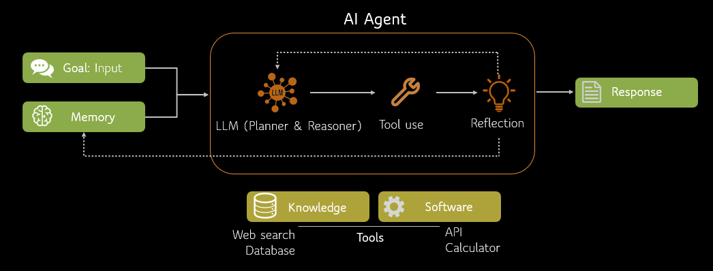
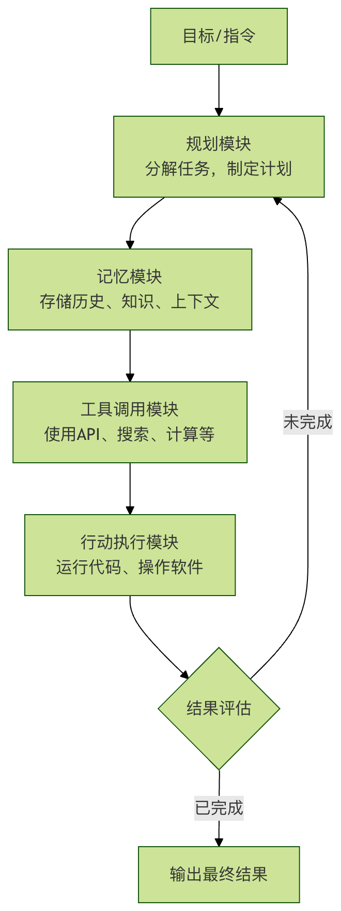
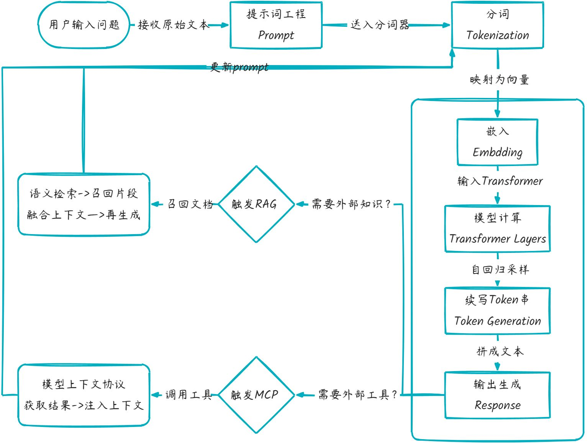

# 概要

## 结构组成

目标：明确任务意图

逻辑：按规则拆成可执行步骤

工具：通过代码或API让步骤落地

## 运行方式：

- 接收输入

- 判断当前任务

- 调用对应工具执行

- 返回结果

- 保留必要上下文

- 支持多轮连续操作

- 遇阻时调整执行步骤

  与普通大模型区别：普通大模型生成文本；Agent生成行动并执行行动，能完成实际工作

Agent架构图：    

# 简介

## 核心组件

Agent=LLM(大脑)+Planning(规划)+Memory(记忆）+Tool use(工具使用)

LPMT:

- LLM：作为核心推理机，负责理解意图、生成文本和进行逻辑判断。

- Planning: 能够将复杂的目标（如"帮我策划一场技术沙龙"）拆解成可执行的步骤。

- Memory: 记录对话历史（短期）和存储专业知识库（长期）。

- Tool use: 能够根据需求去查谷歌搜索、读数据库、甚至跑 Python 代码。
  

Ageng 与传统AI 模型区别：

| 维度         | 传统 AI 模型         | AI Agent                   |
| :----------- | :------------------- | :------------------------- |
| **交互方式** | 单次输入输出         | 多轮对话、持续交互         |
| **决策能力** | 基于输入直接推理     | 规划、反思、迭代优化       |
| **工具使用** | 无法主动调用外部工具 | 可调用搜索、计算器、API 等 |
| **记忆机制** | 仅限当前上下文       | 短期+长期记忆              |
| **目标导向** | 完成单一预测任务     | 完成复杂目标               |
| **错误处理** | 输出即结束           | 可自我纠错、重试           |

**核心模式**：从 Prompt 到 Reasoning Loop

普通的 LLM 只是 **One-shot（一次性）** 的响应，而 Agent 的核心在于 **Iterative（迭代）**。

**ReAct 模式 (Reason + Act)** 是目前最主流的 Agent 推理逻辑：

1. **Thought (思考)：** 模型描述当前要做什么，为什么要这么做。
2. **Action (行动)：** 模型选择一个工具（如：`Google Search`）。
3. **Observation (观察)：** 模型读取工具返回的结果。
4. **Repeat (循环)：** 重复上述步骤，直到得出最终答案。

AI Agent 模块构成：

1、**规划模块**：任务的大脑与指挥官

这是 Agent 的思考中枢。它负责将用户模糊的、高层的目标（如：分析公司上个季度的销售数据）分解成一系列清晰的、可执行的子任务步骤。

- **任务分解**：将大目标拆解为小步骤。例如：1. 连接数据库；2. 提取Q3销售数据；3. 按产品和地区分类；4. 计算环比增长率；5. 生成可视化图表。
- **反思与调整**：Agent 会评估每一步行动的结果。如果失败了（比如数据库连不上），它会反思原因，并调整计划（例如尝试另一种连接方式或请求用户提供密码）。

2. **记忆模块**：经验的笔记本

Agent 需要有记忆才能进行连贯的、基于上下文的对话和操作。

- **短期记忆**：记住当前对话的上下文，确保回答不跑题。
- **长期记忆**：将重要的交互信息、学到的知识存储到数据库或向量数据库中，供未来查询和使用，实现越用越聪明。

3. **工具调用模块**：灵活的双手

这是 Agent 从思考者变为行动者的关键。它可以通过应用程序接口（API）调用外部工具来扩展自身能力。

**常见工具**：

- **搜索工具**：联网获取最新信息。
- **计算器/代码解释器**：进行数学运算或运行代码处理数据。
- **软件操作**：通过 API 发送邮件、操作电子表格、控制智能家居。
- **专业工具**：调用专业软件进行图像生成、语音合成、数据分析等。

**核心特征**：自主性 反应性 主动性 社交能力 学习能力 

工作流程：React=Reasoning(推理)+Acting(行动)

## 主流大语言模型

| 模型名称                             | 所属公司/组织 | 官网                                         | API文档地址                                                  |
| :----------------------------------- | :------------ | :------------------------------------------- | :----------------------------------------------------------- |
| **GPT系列 (GPT-5.2/GPT-4o)**         | OpenAI        | https://openai.com/                          | https://platform.openai.com/docs/api-reference               |
| **Claude系列 (Opus 4.6/Sonnet 4.5)** | Anthropic     | https://www.anthropic.com/                   | https://docs.anthropic.com/claude/reference/getting-started-with-the-api |
| **Gemini系列 (Gemini 3 Pro/Flash)**  | Google        | https://deepmind.google/technologies/gemini/ | https://docs.gemini.com/rest-api/                            |
| **通义千问 (Qwen 3.0系列)**          | 阿里巴巴      | https://www.qianwen.com/                     | https://help.aliyun.com/zh/dashscope/developer-reference/api-details |
| **文心一言 (ERNIE 5.0系列)**         | 百度          | https://yiyan.baidu.com/                     | https://qianfan.cloud.baidu.com/docs/                        |
| **智谱清言 (GLM-4.7系列)**           | 智谱AI        | https://chatglm.cn/                          | https://open.bigmodel.cn/dev/api                             |
| **Kimi (Moonshot K2.5系列)**         | 月之暗面      | https://kimi.moonshot.cn/                    | https://platform.moonshot.cn/docs/api/chat                   |
| **讯飞星火大模型**                   | 科大讯飞      | https://xinghuo.xfyun.cn/                    | https://www.xfyun.cn/doc/spark/Web.html                      |
| **DeepSeek系列**                     | DeepSeek      | https://www.deepseek.com/                    | https://api-docs.deepseek.com/                               |
| **Llama系列 (Llama 3.1/Llama 4)**    | Meta          | https://www.llama.com/                       | https://www.llama.com/docs/overview/                         |
| **Grok系列 (Grok 4.1)**              | xAI           | https://x.ai/                                | https://docs.x.ai/overview                                   |
| **MiniMax (M2.1系列)**               | MiniMax       | https://www.minimaxi.com/                    | https://api.minimax.chat/docs/api/                           |
| **百川智能 (Baichuan 3系列)**        | 百川智能      | https://www.baichuan-ai.com/                 | https://platform.baichuan-ai.com/docs/api                    |
| **Ollama (本地部署模型)**            | Ollama        | https://ollama.com/                          | https://github.com/ollama/ollama/blob/main/docs/api.md       |
| **豆包大模型**                       | 字节跳动      | https://www.doubao.com/                      | https://www.volcengine.com/docs/82379/1399008?lang=zh        |

## 提示词工程

| 要素           | 英文                | 说明                                                         | 示例                                                         |
| :------------- | :------------------ | :----------------------------------------------------------- | :----------------------------------------------------------- |
| **角色与背景** | Capacity & Role     | 为 AI 设定一个身份或场景，引导其使用特定的知识体系和表达方式。 | 你是一位经验丰富的 Python 编程导师。                         |
| **任务与指令** | Insight & Statement | 清晰、具体地说明你要 AI 完成什么任务。这是提示词的核心。     | 请解释 `列表推导式` 的概念，并给出三个由易到难的例子。       |
| **步骤与约束** | Procedure & Steps   | 将复杂任务分解为步骤，或添加格式、长度、风格等限制条件。     | 请按以下步骤回答：1. 一句话定义。2. 语法说明。3. 示例代码及注释。 |
| **输出格式**   | Format & Output     | 明确指定你希望的回答格式，如 JSON、Markdown、表格、代码块等。 | 请将对比结果以表格形式呈现，包含方法、优点、缺点三列。       |
| **输入示例**   | Examples            | 提供一两个输入-输出的例子，让 AI 更准确地模仿你想要的模式（少样本学习）。 | 例如，如果我问苹果，你应该回答它是一种水果。那么，当我问香蕉时… |

 **核心原则**：

- 明确的角色定位 persona
- 清晰的任务指令 task/goal
- 提供足够的背景信息  context
- 限制条件和格式要求 constraints/format

# 大模型基础

## 大模型术语

### 大模型工作流程

| 环节                               | 解释                                                         |
| ---------------------------------- | ------------------------------------------------------------ |
| **提示词 Prompt**                  | 用户给模型的“任务指令”，决定后续所有 token 的生成方向。      |
| **分词 Tokenization**              | 把文本切成模型字典里**有编号的最小片段**（token），供向量层查表。 |
| **嵌入 Embedding**                 | 将每个 token 编号**映射成高维向量**，使语义相近的词在向量空间靠得更近。 |
| **模型计算 Transformer Layers**    | 多层自注意力 + 前馈网络**对整句向量做并行计算**，输出每个位置的上下文语义向量。 |
| **续写 token 串 Token Generation** | 以上一步的向量为基础，**逐个采样下一个 token**，自回归拼成完整回答。 |
| **RAG**                            | 检索增强生成，结合外部知识库进行语义检索并增强生成质量。     |
| **MCP**                            | 模型上下文协议，允许模型调用外部工具或服务（如 API、数据库）扩展能力。 |

### 模型参数类型

#### 稠密模型（Dense Model）

**定义**：在推理或训练时，**所有参数都会被参与计算**。

**特点**：

- 每一层的参数都“稠密连接”在一起
- 每个输入都会激活所有权重（没有参数被“跳过”）

**优点**：

- 结构简单，训练和推理逻辑清晰
- 对小规模模型和常规任务效果稳定

**缺点**：

- 参数量大 → 推理计算和显存占用高
- 无法做到“部分参数参与计算”以节省资源

#### 稀疏模型（Sparse Model）

**定义**：在推理或训练时，**只有部分参数被激活，其余参数不参与计算**。

**常见形式**：

- **权重稀疏化**：把部分权重设为零（例如通过剪枝 pruning），减少计算量
- **激活稀疏化**：某些神经元只有在特定输入下才被激活

**优点**：

- 提升计算效率，降低显存和算力需求
- 仍能保持较高精度

**缺点**：

- 稀疏化的效果和方法依赖任务，可能影响模型表现
- 工程上需要专门的稀疏计算库支持

#### MoE 模型（Mixture of Experts）

**定义**：又称混合专家模型，一种 **稀疏化的特殊形式**。模型内部包含多个“专家子网络”（Experts），每个输入 token 只会激活其中一部分专家（而非全部）。

**核心机制**：

- **门控网络（Gating Network）**：根据输入内容，选择最合适的专家来处理
- **稀疏激活**：例如有 100 个专家，只激活其中 2 个 → 节省计算成本

**优点**：

- 参数量可以非常大（比如上万亿），但实际计算开销比稠密模型低
- 不同专家可以专注于不同知识领域（比如数学专家、代码专家）

**缺点**：

- 训练难度大（负载均衡问题，容易出现部分专家过载）
- 工程复杂度高（需要专门的分布式训练策略）

| 维度             | 稠密模型    | 稀疏模型（广义） | MoE（稀疏的一种）                              |
| ---------------- | ----------- | ---------------- | ---------------------------------------------- |
| **激活比例**     | 100%        | 《10%            | 通常 Top-1 或 Top-2 专家                       |
| **参数总量**     | = 激活量    | 》》激活量       | 同左，易破百亿/千亿                            |
| **计算量 FLOPs** | 高          | 低               | 低（与稀疏一致）                               |
| **显存占用**     | 中          | 高（存全套参数） | 高（存全套专家）                               |
| **通信开销**     | 无          | 低               | 高（需跨设备传专家）                           |
| **训练难度**     | 低          | 中               | 高（负载均衡、门控学习）                       |
| **代表模型**     | GPT-3/LLaMA | 无普遍开源       | Switch-Transformer、GLaM、PaLM-E、DeepSeek-MoE |

### 模型压缩加速

#### 蒸馏模型（Model Distillation）

**定义：\**模型蒸馏（Knowledge Distillation）是一种 \*\*模型压缩技术\*\*，就好比\**“老师教学生”**——用大模型（Teacher）的输出当“软标签”，训练一个小模型（Student）**模仿行为**，参数变少，精度尽量保留。

- 用一个大而强的模型（**教师模型 Teacher**）指导一个小模型（**学生模型 Student**）的训练。
- 学生模型学习的不仅是训练数据的标签，还要模仿教师模型的 **输出分布**（soft targets）。

**原理**

- 教师模型输出一个“软概率分布” (softmax + 温度参数)
- 学生模型通过最小化与教师分布的差异来学习知识
- 最终得到一个更小、更快，但性能接近的学生模型

**优点**

- 大幅降低模型大小和推理延迟
- 在移动端、边缘设备部署更容易
- 保留大部分性能

**缺点**

- 蒸馏效果依赖教师模型的质量
- 蒸馏过程需要额外训练，成本不低

**典型应用**

- BERT → DistilBERT（小一半参数，保留 ~95% 性能）
- GPT 系列在移动端的轻量化版本

#### 量化模型（Model Quantization）

**定义：\**模型量化是一种 \*\*模型推理加速和压缩技术\*\*，就好比\**“削精度减位数”**——把权重/激活的**浮点 32 位→16/8/4 位整数**，存储↓、计算↓、显存↓，直接跑在端侧芯片。

- 将模型参数（权重、激活值）从高精度浮点数（如 FP32）压缩到低比特表示（FP16、INT8、INT4 甚至二值）。

**常见方法**

- **Post-Training Quantization (PTQ)**：训练后直接量化，不需要重新训练
- **Quantization-Aware Training (QAT)**：训练过程中就引入量化，效果更好
- **混合精度（Mixed Precision）**：部分关键层保持高精度，其他层用低精度

**优点**

- 显著减少显存占用（FP32 → INT8 可减 4 倍）
- 提升推理速度（尤其在支持低精度算子的硬件上，如 GPU Tensor Cores / TPU / NPU）
- 能与剪枝、蒸馏结合使用

**缺点**

- 精度可能下降（尤其在极端低比特时，如 INT4）
- 对硬件依赖较强（要支持低比特计算）

**典型应用**

- INT8 BERT、GPTQ（量化 LLM）
- LLaMA、Qwen 等开源大模型常见的 `4bit/8bit` 量化版本，用于个人显卡部署

| 维度               | 知识蒸馏                       | 量化                                 |
| ------------------ | ------------------------------ | ------------------------------------ |
| **目标**           | 模型**结构变小**               | 权重**位数变少**                     |
| **参数量**         | 减少（Student 网络更瘦）       | 不变（只是精度压缩）                 |
| **存储体积**       | ↓↓（结构剪完再量化可叠加）     | ↓↓（通常 4× 或 8×）                  |
| **计算加速**       | 依赖小模型结构                 | 依赖整数单元/专用指令                |
| **精度损失**       | 可控（跟 Teacher 差距）        | 可控（INT8 几乎无损，INT4 需精细调） |
| **是否需要原模型** | 需要 Teacher 在线/离线推理     | 不需要，可后训练直接压               |
| **代表方案**       | MiniLLaMA、DistilBERT、TinyGPT | LLM.int8()、GPTQ、AWQ、KV-cache 量化 |

### 模型训练

#### 大模型预训练

大模型预训练（Pre-training）：模型在大规模通用数据上首先进行无监督或自监督训练，学习通用知识、语义和基本能力。

例如DeepSeek-V3-Base、DeepSeek-V2、DeepSeek-Coder V1未经过任何微调，是预训练大模型。

#### 大模型后训练

大模型后训练 （Post-training）：是在预训练模型基础上，通过人类反馈（SFT/RL）优化行为，使其符合特定需求如人类偏好。

例如DeepSeek-V3、DeepSeek-R1系列、DeepSeek-Coder V2、DeepSeek-VL2都是后训练大模型。

| 维度     | 预训练模型           | 后训练模型                    |
| -------- | -------------------- | ----------------------------- |
| 目标     | 学习语言通用规律     | 对齐人类偏好，专精任务        |
| 数据     | 无标注文本（万亿级） | 带标注指令/偏好数据（百万级） |
| 典型技术 | MoE架构、FP8混合精度 | GRPO强化学习、思维链蒸馏      |
| 输出特点 | 通用文本生成         | 结构化答案、分步推理          |

### 大模型微调

微调其实也是模型后训练的一种方法。 只是后训练通常由模型提供商负责，会在出厂前进行预训练和后训练，以便把模型打造成可交付的状态，而微调这种后训练，一般由模型使用者（甲方自己的技术团队或技术厂商）进行，以便实现领域垂直大模型。

例如通用模型已掌握医学基础知识（如解剖学名词），但要做心脏手术还需专项训练

定向输入：给模型海量心脏病例和手术记录（特定领域数据）

专家经验（示范）：展示优秀医生的诊断思路（带答案的例题，即问答对）

模拟考核：让模型诊断病例并评分，重点纠正误诊（模型评价）

微调本质：在预训练模型上，用少量专业数据（如1%原数据量）调整部分参数。就像让全科医生专攻心血管科——保留基础能力（如问诊技巧），强化专科知识（如心电图解读）。

微调后的模型能像资深医生一样，根据症状精准判断病因 。

微调的方法有很多种，常用方法有：

#### 全量微调

全量微调是在预训练模型的基础上，对所有参数进行微调。在参数修改方面，所有参数都会被更新。其优点显著，能够充分利用预训练模型的通用知识，同时针对特定任务进行优化，通常可以获得较好的性能。

然而，该方法也存在明显不足，计算资源需求较高，尤其是对于参数量非常大的模型来说，这一问题更为突出；训练时间较长，而且在数据量较少的情况下，可能会导致模型过拟合。

#### 参数高效微调

参数高效微调的核心是只对模型的一部分参数进行微调，保持大部分参数不变，这使得它在资源利用上更加高效。

以下是几种常见的参数高效微调方法：

**LoRA（Low-Rank Adaptation）**

LoRA 通过低秩分解来调整模型的权重矩阵，只训练少量的新增参数。这种方法的优点是计算资源需求低，训练时间短，并且保留了预训练模型的大部分知识。不过，其缺点是可能达不到全量微调的性能。

**Prefix-Tuning**

Prefix-Tuning 在模型的输入端添加可训练的前缀，这些前缀参数在微调过程中被更新。它适用于自然语言生成任务，具有计算资源需求低、训练时间短的优点，但可能需要更多的调参经验。

**Adapter**

Adapter 在模型的每一层或某些层之间插入可训练的适配器模块，这些适配器参数在微调过程中被更新。该方法计算资源需求低、训练时间短，还可以针对多个任务进行微调，不过同样可能需要更多的调参经验。

**BitFit**

BitFit 只微调模型的偏置项（bias terms），而不改变权重。其最大优势是计算资源需求极低，训练时间非常短，但性能提升可能有限。

#### 强化学习微调

强化学习微调使用强化学习方法，通过人类反馈或其他奖励信号来优化模型，模型参数会根据奖励信号进行更新。它的优点在于可以优化模型的交互行为，特别是在对话系统等交互式任务中，还能更灵活地调整模型的行为以满足特定的业务需求。但该方法实现复杂，需要设计合适的奖励机制，且训练过程可能不稳定，需要更多的调试和监控。

#### 提示调优

提示调优通过冻结整个预训练模型，只允许每个下游任务在输入文本前面添加可调的标记（Token）来优化模型参数，仅更新提示部分的参数。它具有计算资源需求低、训练时间短的优点，适用于少样本学习任务。不过，其可能达到的性能可能略低于全量微调，且需要精心设计提示。

#### 深度提示调优

深度提示调优在预训练模型的每一层应用连续提示，而不仅仅是输入层，同样只更新提示部分的参数。这种方法可以在更深层次上优化模型，提高性能，适用于复杂任务，但实现复杂，需要更多的调参经验。

#### 动态低秩适应

DyLoRA 在 LoRA 的基础上，动态调整低秩矩阵的大小，动态调整低秩矩阵的大小，只更新部分参数。它计算资源需求低，训练时间短，可以在更广泛的秩范围内优化模型性能，但实现复杂，需要更多的调参经验。

#### 自适应低秩适应

AdaLoRA 根据权重矩阵的重要性得分，自适应地分配参数规模，根据重要性动态调整参数规模，只更新部分参数。该方法计算资源需求低，训练时间短，可以更高效地利用参数，提高模型性能，但同样存在实现复杂、需要更多调参经验的问题。

#### 量化低秩适应

QLoRA 结合 LoRA 方法与深度量化技术，减少模型存储需求，同时保持模型精度，只更新部分参数，同时进行量化。它计算资源需求低，训练时间短，适用于资源有限的环境，但实现复杂，需要更多的调参经验。

### 大模型推理

| 阶段 | 目标             | 数据量   | 学习方式        | 成果表现           |
| ---- | ---------------- | -------- | --------------- | ------------------ |
| 训练 | 建立基础知识体系 | 百万亿级 | 无监督学习      | 通晓语言和常识     |
| 微调 | 培养专业能力     | 千万级   | 有监督+强化学习 | 专科医生水平       |
| 推理 | 解决具体问题     | 实时输入 | 概率计算        | 生成定制化解决方案 |

### 大模型部署

#### 单机 TP 模式

**定义**：Tensor Parallel, 张量并行。在单台机器上，利用多张 GPU 对一个层内部的矩阵乘法等计算进行 **张量级拆分**。

**特点**：

- 单层参数被切分到不同 GPU 上执行，比如把权重矩阵横向或纵向分块。
- 各 GPU 并行完成部分计算，再通过通信聚合结果。

**适用场景**：单机多卡，模型权重大，单卡显存放不下时。

**代价**：通信量较大（AllReduce/AllGather）。

#### 单机 EP 模式

**定义**：Expert Parallel, 专家并行。在单机多卡下，部署 **Mixture-of-Experts (MoE)** 模型时，每张 GPU 只存储部分专家网络（Experts）。

**特点**：

- 输入 token 会根据路由器 (Router) 分配到相应的专家所在的 GPU。
- 可以显著减少单卡显存占用，提升模型容量。

**适用场景**：MoE 模型（比如 DeepSeekMoE），需要单机就能容纳上百亿以上参数。

**代价**：需要高效的路由与负载均衡，否则会造成卡间负载不均。

#### 多机 TP 模式

**定义**：将 **张量并行** 扩展到多机多卡，跨机器切分权重矩阵。

**特点**：

- 每层的参数和计算进一步拆分，涉及跨节点通信（一般走高速网络如 InfiniBand）。
- 常和 **流水线并行 (PP)**、**数据并行 (DP)** 结合使用。

**适用场景**：模型超大（百亿 ~ 千亿参数），单机算力不够。

**代价**：网络通信成为瓶颈，带宽和延迟要求高。

#### 多机 EP 模式

**定义**：将 **专家并行** 扩展到多机，每台机器的 GPU 保存不同子集的专家。

**特点**：

- Router 需要跨机调度 token → 对应专家 → 返回结果。
- 单机放不下所有专家时的必选方案。

**适用场景**：千亿级 MoE 模型，比如 DeepSeek-R1、GPT-MoE 系列。

**代价**：跨机通信开销更大，对路由调度系统要求更高。

#### PD 分离模式

**定义**：Prefill-Decoding Separation，将推理过程中的 **预填充 (Prefill)** 和 **解码 (Decoding)** 阶段拆分到不同的计算节点。

**特点**：

- **预填充**：对输入 prompt 进行一次性计算，耗时长但并行度高。
- **解码**：生成阶段，每步依赖上一步结果，序列化强，吞吐低。
- 分离后可按需分配资源，提升整体吞吐。

**适用场景**：在线服务，既要处理长 prompt，又要保证生成的低延迟。

#### 多 PD Master 模式

**定义**：多个 **Prefill-Decoding Master 节点** 共同调度推理请求，避免单点瓶颈。

**特点**：

- 支持多 Master 协同负载均衡。
- 每个 Master 可独立分配请求到 Prefill / Decode 工作节点。
- 提高可扩展性和容错性。

**适用场景**：大规模推理服务，海量并发请求，要求高可用。

#### 总结对比

| 模式         | 粒度           | 主要目标          | 典型场景           |
| ------------ | -------------- | ----------------- | ------------------ |
| 单机 TP      | 层内张量切分   | 显存放不下单层    | 单机多卡部署大模型 |
| 单机 EP      | 专家分布在单机 | MoE 显存节省      | 小规模 MoE         |
| 多机 TP      | 跨机张量并行   | 超大模型训练/推理 | 千亿模型           |
| 多机 EP      | 专家跨机分布   | MoE 扩展          | 千亿 MoE 模型      |
| PD 分离      | 阶段拆分       | 吞吐优化          | 在线推理           |
| 多 PD Master | 调度层冗余     | 高可用 + 扩展     | 大规模服务         |

### 大模型精度

在深度学习中，“精度”指的是模型在计算中表示数值的**位数和范围**，通常用浮点数格式表示（FP = Floating Point）。
主要几种常见精度如下（以 IEEE 754 格式为例）：

| 精度类型            | 位数  | 说明                             | 优点                         | 缺点                               |
| ------------------- | ----- | -------------------------------- | ---------------------------- | ---------------------------------- |
| **FP64 (double)**   | 64 位 | 1 位符号 + 11 位指数 + 52 位尾数 | 精度最高，科学计算用         | 速度慢、显存占用大                 |
| **FP32 (single)**   | 32 位 | 1 位符号 + 8 位指数 + 23 位尾数  | 精度较高，常用于训练         | 占显存大，计算慢于低精度           |
| **FP16 (half)**     | 16 位 | 1 位符号 + 5 位指数 + 10 位尾数  | 显存占用小，速度快           | 精度损失，易出现溢出/下溢          |
| **BF16 (bfloat16)** | 16 位 | 1 位符号 + 8 位指数 + 7 位尾数   | 与 FP32 相同指数范围，精度低 | 速度快，易训练大模型               |
| **FP8**             | 8 位  | 两种常见格式（E5M2 / E4M3）      | 极小显存占用，速度极快       | 精度损失明显，需配合量化和算法优化 |

**关键点：**

- 精度越高，表示范围和数值精确度越好，但计算更慢、显存占用更多。
- 低精度计算（如 FP16、BF16、FP8）可以加快训练速度、降低显存压力，但需要一定的数值稳定性优化。

### 混合精度

混合精度训练指在同一模型的训练过程中同时使用多种数值精度（通常是 FP16/BF16 和 FP32）来计算。
其核心目标是在不影响模型最终精度的情况下，提升训练速度并减少显存占用。

典型的混合精度训练做法：

- 权重存储

主权重（master weights）用 FP32 保存，以避免精度损失。

- 前向传播和反向传播计算

大部分矩阵乘法、卷积运算用 FP16 / BF16 计算，以加快速度并节省显存。

- 梯度缩放（Gradient Scaling）

由于 FP16 数值范围较小，为防止梯度下溢（underflow），会在反向传播前先乘一个缩放因子，再在更新前还原。

- 损失函数计算

一般用 FP32 计算，保持数值稳定性。

**混合精度的好处**

- 更快：FP16/BF16 运算在 GPU 张量核心（Tensor Core）上速度更快（尤其是 NVIDIA Volta、Ampere、Hopper 架构）。
- 更省显存：同样显存下，可以训练更大的 batch size 或更大的模型。
- 几乎无精度损失：合理使用梯度缩放等技术，最终模型精度和全 FP32 基本一致。

**使用场景**

- 大模型训练（LLM、Transformer）：常用 BF16/FP16 混合精度。
- 推理：甚至可以用 FP8 / INT8 混合精度（量化推理）。
- 分布式训练：混合精度能减少通信带宽压力。

