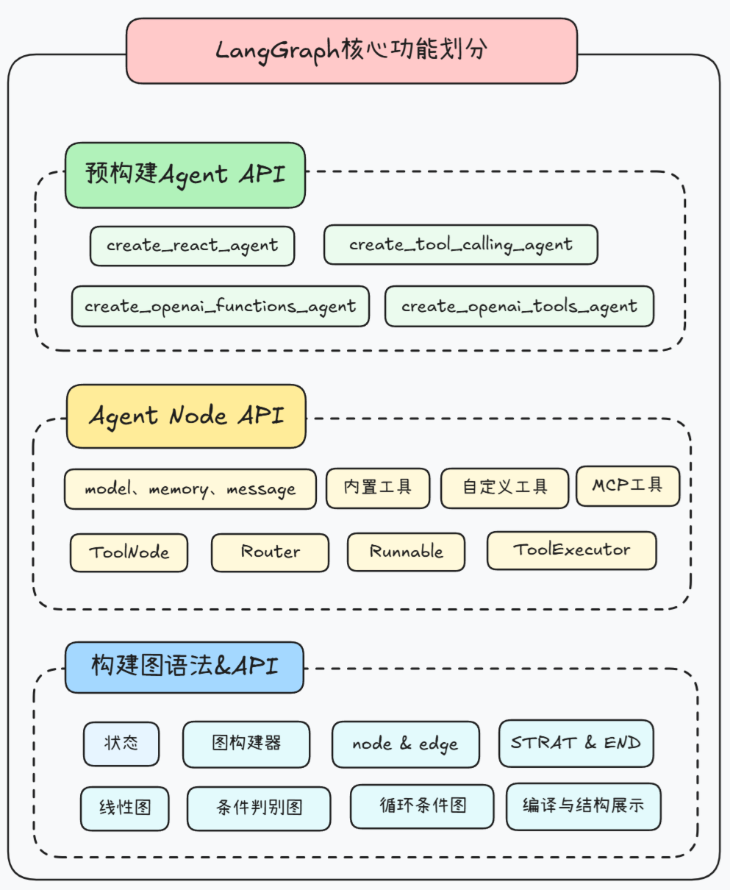
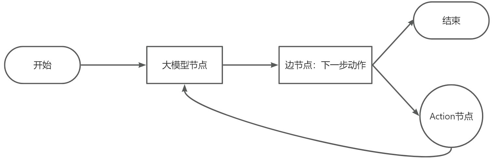
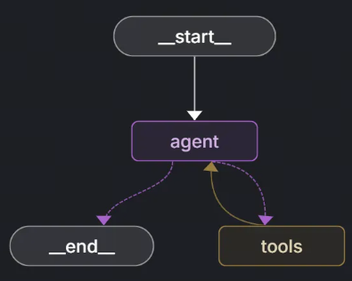
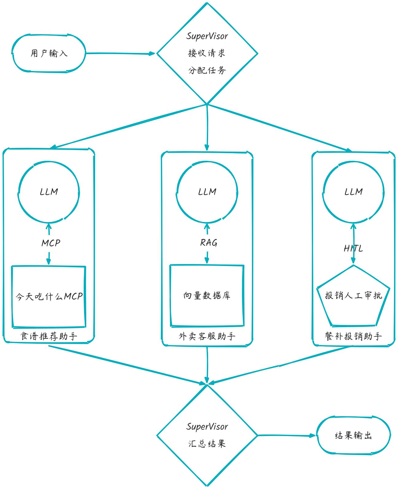

# 1.介绍

## LangGraph技术架构

LangGraph的高层API主要分为两层，其一是Agent API，用于将大模型、提示词模板、外部工具等关键元素快速封装为图中的一些节点，而更高一层的封装，则是进一步创建一些预构建的Agent、也就是预构建好的图。



## LangGraph开发工具套件

- 运行监控框架LangSmith 

- 图结构可视化与调试框架LangGraph Studio

- 服务部署工具LangGraph Cli

- Agent前端可视化工具：Agent Chat UI

- 内置工具库与MCP调用组件 

  LangChain工具集：https://python.langchain.com/docs/integrations/tools/

# 2.构建智能体用工具

## 创建LangGraph智能体

### 预构建智能体API简介

LangGraph 提供了四组“预构建图”级别的 Agent API，用户无需自己拼节点、连边，只要给模型和工具即可一键拿到一个可运行、可观测、带记忆的图。

| API                             | 底层机制              | 场景适合度            | 特点         |
| ------------------------------- | --------------------- | --------------------- | ------------ |
| `create_react_agent`            | ReAct 推理 + 工具调用 | 多步推理、需要 trace  | 灵活但复杂   |
| `create_tool_calling_agent`     | LLM 原生 tool_call    | 单步/轻量多步调用     | 简洁         |
| `create_openai_functions_agent` | OpenAI Functions API  | 兼容旧接口            | 不推荐新项目 |
| `create_openai_tools_agent`     | OpenAI Tools API      | OpenAI 新模型工具调用 | 推荐         |

其中 React Agent（Reason + Act）是使用最多的一种经典的推理–执行型智能体模式：先思考（Reason），再选择动作（Act）。

### 接入自定义工具函数

LangGraph接入工具函数类别和LangChain一样有三类：LangChain内置的工具函数、自定义工具函数和使用MCP工具。我们这里通过自定义工具函数进行演示。

1. 创建自定义获取天气信息的工具函数，为了更加严谨，我们使用`pydantic`库定义一个对象类型描述传入参数，这里表示要传入的是一个字符串 city 参数，表示的含义是城市名称。定义的`WeatherQuery`对象在`@tool(args_schema=WeatherQuery)`中约束`get_weather`的函数参数。`tool`装饰器可以将自定义函数修饰为LangChain/LangGraph的函数工具， 注意函数的注释必须要撰写清楚才能使大模型理解函数功能。

   ```
   import json
   import os
   import httpx
   import dotenv
   from loguru import logger
   from pydantic import Field, BaseModel
   from langchain_core.tools import tool
   
   # 加载环境变量配置
   dotenv.load_dotenv()
   
   class WeatherQuery(BaseModel):
       """
       天气查询参数模型类，用于定义天气查询工具的输入参数结构。
       
       :param city: 城市名称，字符串类型，表示要查询天气的城市
       """
       city: str = Field(description="城市名称")
   
   @tool(args_schema=WeatherQuery)
   def get_weather(city):
       """
       查询指定城市的即时天气信息。
   
       :param city: 必要参数，字符串类型，表示要查询天气的城市名称。
                    注意：中国城市需使用其英文名称，如 "Beijing" 表示北京。
       :return: 返回 OpenWeather API 的响应结果，URL 为
                https://api.openweathermap.org/data/2.5/weather。
                响应内容为 JSON 格式的字符串，包含详细的天气数据。
       """
       # 构建请求 URL
       url = "https://api.openweathermap.org/data/2.5/weather"
   
       # 设置查询参数
       params = {
           "q": city, # 城市名称
           "appid": os.getenv("OPENWEATHER_API_KEY"),  # 从环境变量中读取 API Key
           "units": "metric",  # 使用摄氏度作为温度单位
           "lang": "zh_cn"     # 返回简体中文的天气描述
       }
   
       # 发送 GET 请求并获取响应
       response = httpx.get(url, params=params)
   
       # 将响应解析为 JSON 并序列化为字符串返回
       data = response.json()
       logger.info(f"查询天气结果：{json.dumps(data)}")
       return json.dumps(data)
   
   print(get_weather.name)
   print(get_weather.description)
   print(get_weather.args)
   ```

   

2. 创建 LangGraph 智能体。初始化大模型和函数列表并创建ReACT预制图结构并构建智能体。

   ```
   from langchain_ollama import ChatOllama
   from langgraph.prebuilt import create_react_agent
   from tools import get_weather
   
   # 初始化本地大语言模型，配置基础URL、模型名称和推理模式
   llm = ChatOllama(base_url="http://localhost:11434", model="qwen3:14b", reasoning=False)
   
   # 定义工具列表，包含天气查询工具
   tools = [get_weather]
   
   # 创建ReAct代理，结合语言模型和工具函数
   agent = create_react_agent(model=llm, tools=tools)
   
   # 调用代理处理用户查询，获取北京天气信息
   response = agent.invoke({"messages": [{"role": "user", "content": "请问北京今天天气如何？"}]})
   # 输出完整响应结果和最终回答内容
   print(response)
   print(response["messages"][-1].content)
   response["messages"][-1].pretty_print()
   # 使用stream方法进行流式调用
   for chunk in agent.stream(
           {"messages": [{"role": "user", "content": "请问北京今天天气如何？"}]},
           stream_mode="values",
   ):
       chunk["messages"][-1].pretty_print()
   # 这里stream_mode有四种选项：
   # - messages：流式输出大语言模型回复的token
   # - updates : 流式输出每个工具调用的每个步骤。
   # - values : 一次输出到所有的chunk。默认值。
   # - custom : 自定义输出。主要是可以在工具内部使用get_stream_writer获取输入流，添加自定义的内容。
   ```

### LangGraph ReACT图结构浅析

LangGraph框架是通过Nodes（点）和Edges(边）的组合去创建复杂的循环工作流程，通过消息传递的方式串联所有节点形成一个通路。为了维持消息能够及时的更新并能够在节点中反复传递，则LangGraph构建了 State状态 的概念。每启动一个LangGraph构建流都会生成一个状态，图中的节点在处理时会传递和修改该状态。整个状态不仅仅是一组静态数据，更是根据每个节点的输出动态更新的，然后影响循环内的后续操作。



ReACT图具体流程如下:

1. 开始： 接收用户的输入
2. 调用模型： 将当前状态传递给大模型要求模型思考
3. 模型决策： 大模型会以特定格式返回一个响应，
	这个响应可能是：
    最终答案: 如果模型认为信息足够，就直接回答用户
	工具调用：如果模型认为需要更多信息，它会决定调用哪个工具
	

4.执行工具：如果模型决定调用工具，图就会执行该工具，并获取工具返回的结果
5.更新状态：将工具的执行结果添加到状态中
6.循环：带着新的信息回到第2步，让模型再次思考
7.结束：当模型返回最终答案时，循环结束，图运行完成将结果返回给用户。

## ReAct Agent 外部工具调用形式

### 添加多个工具函数

```
import json
import os
import httpx
import dotenv
from loguru import logger
from pydantic import Field, BaseModel
from langchain_core.tools import tool

# 加载环境变量配置
dotenv.load_dotenv()


class WeatherQuery(BaseModel):
    """
    天气查询参数模型类，用于定义天气查询工具的输入参数结构。

    :param city: 城市名称，字符串类型，表示要查询天气的城市
    """
    city: str = Field(description="城市名称")


class WriteQuery(BaseModel):
    """
    写入查询模型类
    
    用于定义需要写入文档的内容结构，继承自BaseModel基类
    
    属性:
        content (str): 需要写入文档的具体内容，包含详细的描述信息
    """
    content: str = Field(description="需要写入文档的具体内容")


@tool(args_schema=WeatherQuery)
def get_weather(city):
    """
    查询指定城市的即时天气信息。

    :param city: 必要参数，字符串类型，表示要查询天气的城市名称。
                 注意：中国城市需使用其英文名称，如 "Beijing" 表示北京。
    :return: 返回 OpenWeather API 的响应结果，URL 为
             https://api.openweathermap.org/data/2.5/weather。
             响应内容为 JSON 格式的字符串，包含详细的天气数据。
    """
    # 构建请求 URL
    url = "https://api.openweathermap.org/data/2.5/weather"

    # 设置查询参数
    params = {
        "q": city,  # 城市名称
        "appid": os.getenv("OPENWEATHER_API_KEY"),  # 从环境变量中读取 API Key
        "units": "metric",  # 使用摄氏度作为温度单位
        "lang": "zh_cn"  # 返回简体中文的天气描述
    }

    # 发送 GET 请求并获取响应
    response = httpx.get(url, params=params)

    # 将响应解析为 JSON 并序列化为字符串返回
    data = response.json()
    logger.info(f"查询天气结果：{json.dumps(data)}")
    return json.dumps(data)


@tool(args_schema=WriteQuery)
def write_file(content):
    """
    将指定内容写入本地文件
    
    参数:
        content (str): 要写入文件的文本内容
    
    返回值:
        str: 表示写入操作成功完成的提示信息
    """
    # 将内容写入res.txt文件，使用utf-8编码确保中文字符正确保存
    with open('res.txt', 'w', encoding='utf-8') as f:
        f.write(content)
        logger.info(f"已成功写入本地文件，写入内容：{content}")
        return "已成功写入本地文件。"
```

### 工具并联调用

```
from langchain_ollama import ChatOllama
from tools import get_weather, write_file
from langgraph.prebuilt import create_react_agent

# 初始化本地大语言模型，配置基础URL、模型名称和推理模式
llm = ChatOllama(model="qwen3:14b", reasoning=False)

# 定义工具列表，包含天气查询和结果写入工具
tools = [get_weather, write_file]

# 创建ReAct代理，结合语言模型和工具函数
agent = create_react_agent(model=llm, tools=tools)

# 调用代理处理用户查询，获取北京天气信息
response = agent.invoke({"messages": [{"role": "user", "content": "请问北京和上海今天谁更热？"}]})

# 输出完整响应结果和最终回答内容
print(response)
response["messages"][-1].pretty_print()
```

### 工具串联调用

```
from langchain_ollama import ChatOllama
from tools import get_weather, write_file
from langgraph.prebuilt import create_react_agent

# 初始化本地大语言模型，配置基础URL、模型名称和推理模式
llm = ChatOllama( model="qwen3:14b", reasoning=False)

# 定义工具列表，包含天气查询和结果写入工具
tools = [get_weather, write_file]

# 创建ReAct代理，结合语言模型和工具函数
agent = create_react_agent(model=llm, tools=tools)

# 调用代理处理用户查询，获取北京天气信息
response = agent.invoke({"messages": [{"role": "user", "content": "请问北京天气怎么样？然后把回答结果写入文件。"}]})
# 输出完整响应结果和最终回答内容
print(response)
response["messages"][-1].pretty_print()
```

## ReAct智能体内部工具调用

### LangChain内置工具

langChain 官方文档将这些工具按照其用途进行了模块化划分，大家可参考官网https://python.langchain.com/docs/integrations/tools/

### 创建带搜索功能的Agent

```
import os
import dotenv
from langchain_ollama import ChatOllama
from langchain_community.utilities import GoogleSerperAPIWrapper
from langgraph.prebuilt import create_react_agent
from langchain_community.tools import GoogleSerperRun
# 加载环境变量配置文件
dotenv.load_dotenv()
# 从环境变量中获取Serper API密钥
api_key = os.getenv("SERPER_API_KEY")
# 创建Google Serper API包装器实例
api_wrapper = GoogleSerperAPIWrapper()
# 创建Google搜索工具实例
search_tool = GoogleSerperRun(api_wrapper=api_wrapper)
# 初始化本地大语言模型，配置基础URL、模型名称和推理模式
llm = ChatOllama(base_url="http://localhost:11434", model="qwen3:14b", reasoning=False)

# 定义工具列表，包含天气查询和结果写入工具
tools = [search_tool]

# 创建ReAct代理，结合语言模型和工具函数
agent = create_react_agent(model=llm, tools=tools)

# 调用工具处理用户查询
response = agent.invoke({"messages": [{"role": "user", "content": "小米最近发布的新品是什么？"}]})
# 输出完整响应结果和最终回答内容
print(response)
response["messages"][-1].pretty_print()
```

# 3.LangGraph全家桶

## LangGraph

基于有向图（State Graph）的 AI 应用框架，用来构建多步推理、Agent 协作和可控对话流程。相比直接写 Chain，更结构化、可观测。

## LangSmith

平台化工具，用于 调试、观测、评估 LangChain / LangGraph 应用。可以记录运行轨迹、比较不同版本、做回放和质量评估。

## LangGraph Studio

一个 可视化 IDE，支持拖拽式创建/修改 LangGraph 流程，实时运行和调试节点逻辑。对非纯代码开发者特别友好。

## LangGraph CLI

命令行工具，用来 初始化项目、运行、部署 LangGraph 应用。比如 `langgraph dev` 本地调试，`langgraph deploy` 一键上云。

## Agent Chat UI

一个现成的 聊天前端（React + Tailwind），直接对接 LangGraph Agent 服务，用来展示对话、思维链、工具调用等。

**LangGraph 提供了开发框架，LangSmith 做监控和评估，Studio 做可视化构建，CLI 管理项目和部署，Agent Chat UI 提供用户界面 —— 一套从开发到调试、部署、交互的完整闭环。**

# 4.使用底层API构建图

## 图结构创建与使用

### 图结构概念

LangGraph的宗旨是创建一个图结构，该图结构包含大模型、外部工具等，通过点线间的连接构成灵活的处理链路。基于该宗旨，LangGraph定义了一套由点、边、状态组成的有向有环的结构图语法。



### 节点（Nodes)

任何可执行的功能包括大语言模型API，工具，甚至Agent都可以作为LangGraph图的点。

### 边（Edges）

边通常负责传递数据，也有一些边负责进行逻辑控制，例如if-else的判断和选择，从而让整个图状结构更加丰富。

### State（状态）

LangGraph通过组合点和边去创建复杂的循环工作流程，节点产生的消息通过边传递给别的节点从而形成通路。为了维持节点和边之间的消息传递，LangGraph势必要对所有的消息进行统一管理，这就引出了概念“State（状态）”。

在LangGraph构建的流程中，每次执行都会启动一个状态，图中的节点在处理时会传递和修改该状态。这个状态不仅仅是一组静态数据，而是由每个节点的输出动态更新，然后影响循环内的后续操作，确保图通路顺畅。

## 手动创建图流程

构建一个加减法图工作流，我们这里自定义两个简单函数：一个是加法函数接收当前State并将其中的x值加1，另一个是减法函数接收当前State并将其中的x值减2，然后添加名为`addition`和`subtraction`的节点，并关联到两个函数上，最后构建出节点之间的边。

```
from langgraph.constants import START, END
from langgraph.graph import StateGraph
builder = StateGraph(dict)

def addition(state):
    """
    执行加法运算的节点函数

    参数:
        state (dict): 包含输入数据的状态字典，必须包含键"x"

    返回:
        dict: 返回更新后的状态字典，其中"x"的值增加1
    """
    print(f'加法节点收到的初始值:{state}')
    return {"x": state["x"] + 1}

def subtraction(state):
    """
    执行减法运算的节点函数

    参数:
        state (dict): 包含输入数据的状态字典，必须包含键"x"

    返回:
        dict: 返回更新后的状态字典，其中"x"的值减少2
    """
    print(f'减法节点收到的初始值:{state}')
    return {"x": state["x"] - 2}

# 向图构建器中添加节点
# 添加加法运算节点和减法运算节点到构建器中
builder.add_node("addition", addition)
builder.add_node("subtraction", subtraction)

# 定义节点之间的执行顺序 edges
# 设置节点间的依赖关系，形成执行流程图
builder.add_edge(START, "addition")
builder.add_edge("addition", "subtraction")
builder.add_edge("subtraction", END)
# 编译图构建器生成计算图
graph = builder.compile()

# 打印图的边和节点信息
print(builder.edges)
print(builder.nodes)
# 打印图的可视化结构
print(graph.get_graph().print_ascii())
# 打印图可视化结构Mermaid 代码，通过processon 编辑器查看
print(graph.get_graph().draw_mermaid())
```


## 图对象运行

当我们通过`builder.compile()`方法编译图后，编译后的`graph`对象提供了`invoke`方法，该方法用于启动图的执行。在图执行前我们需要通过`invoke`方法传递一个初始状态，这个状态作为图执行的起始输入：

```
# 定义一个初始状态字典，包含键值对"x": 5
initial_state={"x": 5}
# 调用graph对象的invoke方法，传入初始状态，执行图计算流程
result= graph.invoke(initial_state)
print(f"最后的结果是:{result}")
```

## 借助Pydantic构建稳定的State

以上的写法虽然灵活但有一个致命缺陷，我们的State状态缺乏预定义的模式，节点可以在没有严格类型约束的情况下自由地读取和写入状态，这样的灵活性虽然有利于动态数据处理，但这也要求开发者在整个图的执行过程中保持对键和值的一致性管理（例如我们在加减法函数中返回的都是只包含键值对x的字典对象）。因为在任何节点中尝试访问State中不存在的键，会直接中断整个图的运行状态。

### Pydantic基本使用

通过集成pydantic中的`BaseModel`抽象类来定义状态State, 定义后的状态可以对键值对属性进行自动校验，我们编写如下代码，对 a 和 b 键定义不同的类型，错误的类型会报错。

```
from pydantic import BaseModel
class MyState(BaseModel):
    a: int
    b: str="default"
# 自动校验
state = MyState(a=1)
print(state.a)
print(state.b)
# 类型错误会报错
state = MyState(a="aaa")
print(state.a)
```

### Pydantic应用于StateGraph

使用`Pydantic`对代码进行修改,采用如下方法编写的代码可以对状态键内容和属性进行约束，代码健壮性更强。

```
from langgraph.constants import START, END
from langgraph.graph import StateGraph
from pydantic import BaseModel

class CalcState(BaseModel):
    """
    定义计算过程中使用的状态模型

    属性:
        x (int): 用于传递和更新的整型数值
    """
    x: int
    
builder = StateGraph(CalcState)

def addition(state):
    """
    执行加法运算的节点函数

    参数:
        state (CalcState): 包含输入数据的状态对象，必须包含属性"x"

    返回:
        CalcState: 返回更新后的状态对象，其中"x"的值增加1
    """
    print(f'加法节点收到的初始值:{state}')
    return CalcState(x=state.x + 1)


def subtraction(state):
    """
    执行减法运算的节点函数

    参数:
        state (CalcState): 包含输入数据的状态对象，必须包含属性"x"

    返回:
        CalcState: 返回更新后的状态对象，其中"x"的值减少2
    """
    print(f'减法节点收到的初始值:{state}')
    return CalcState(x=state.x - 2)


# 向图构建器中添加节点
# 添加加法运算节点和减法运算节点到构建器中
builder.add_node("addition", addition)
builder.add_node("subtraction", subtraction)

# 定义节点之间的执行顺序 edges
# 设置节点间的依赖关系，形成执行流程图
builder.add_edge(START, "addition")
builder.add_edge("addition", "subtraction")
builder.add_edge("subtraction", END)

# 编译图构建器生成计算图
graph = builder.compile()

# 打印图的边和节点信息
print(builder.edges)
print(builder.nodes)

# 打印图的可视化结构
print(graph.get_graph().print_ascii())

# 定义一个初始状态对象，包含属性"x"为5
initial_state = CalcState(x=5)

# 调用graph对象的invoke方法，传入初始状态，执行图计算流程
result = graph.invoke(initial_state)

print(f"最后的结果是:{result}")

```

需要注意的是在调用大模型过程中， LangGraph 的内部机制是直接操作字典，不调用模型的构造函数。 如果继续用 `BaseModel`，LangGraph 不会知道如何合并、序列化这些字段，因此在调用大模型过程中，要设置为 TypedDict

| 对比项            | `TypedDict`              | `BaseModel`(Pydantic)              |
| ----------------- | ------------------------ | ---------------------------------- |
| 来源              | Python 标准库 (`typing`) | Pydantic 库                        |
| 定位              | 类型提示（轻量字典类型） | 强类型数据模型（含验证逻辑）       |
| 运行时检查        | ❌ 无运行时校验           | ✅ 自动校验字段类型、默认值等       |
| 继承自            | `dict`                   | `BaseModel`                        |
| 性能              | ✅ 快（仅静态类型提示）   | ⚠️ 稍慢（需要解析和验证）           |
| 序列化 / 反序列化 | ❌ 手动处理               | ✅ 自动 `.dict()`, `.json()`        |
| 用途场景          | 简单数据结构定义         | 需要验证、解析、约束的模型         |
| LangGraph 支持    | ✅ 官方推荐（State 类型） | ⚠️ 不推荐（除非你自己控制模型转换） |

## 流程控制语句

### 条件判断

使用langgraph构建了一个状态图，根据输入数值的奇偶性执行不同节点。check_x接收并传递状态，is_even判断奇偶，handle_even和handle_odd分别处理偶数和奇数情况，最终输出结果。

```
from typing import Optional
from langgraph.constants import START, END
from langgraph.graph import StateGraph
from loguru import logger
from pydantic import BaseModel


class MyState(BaseModel):
    """
    定义状态模型，用于在图节点之间传递数据
    
    Attributes:
        x (int): 输入的整数
        result (Optional[str]): 处理结果，可为"even"或"odd"
    """
    x: int
    result: Optional[str] = None


builder = StateGraph(MyState)


def check_x(state: MyState) -> MyState:
    """
    检查输入状态的节点函数
    
    Args:
        state (MyState): 包含输入数据的状态对象
        
    Returns:
        MyState: 返回原始状态对象，未做修改
    """
    logger.info(f"[check_x] Received state: {state}")
    return state


def is_even(state: MyState) -> bool:
    """
    判断状态中x值是否为偶数的条件函数
    
    Args:
        state (MyState): 包含待判断数值的状态对象
        
    Returns:
        bool: 如果x是偶数返回True，否则返回False
    """
    return state.x % 2 == 0


def handle_even(state: MyState) -> MyState:
    """
    处理偶数情况的节点函数
    
    Args:
        state (MyState): 包含偶数输入的状态对象
        
    Returns:
        MyState: 返回更新后的状态对象，result设置为"even"
    """
    logger.info("[handle_even] x 是偶数")
    return MyState(x=state.x, result="even")


def handle_odd(state: MyState) -> MyState:
    """
    处理奇数情况的节点函数
    
    Args:
        state (MyState): 包含奇数输入的状态对象
        
    Returns:
        MyState: 返回更新后的状态对象，result设置为"odd"
    """
    logger.info("[handle_odd] x 是奇数")
    return MyState(x=state.x, result="odd")


builder.add_node("check_x", check_x)
builder.add_node("handle_even", handle_even)
builder.add_node("handle_odd", handle_odd)


def is_even(state: MyState) -> bool:
    """
    判断状态中x值是否为偶数的条件函数
    
    Args:
        state (MyState): 包含待判断数值的状态对象
        
    Returns:
        bool: 如果x是偶数返回True，否则返回False
    """
    return state.x % 2 == 0


# 添加条件边，根据is_even函数的返回值决定流向哪个节点
builder.add_conditional_edges("check_x", is_even, {
    True: "handle_even",
    False: "handle_odd"
})

# 添加起始边，从START节点流向check_x节点
builder.add_edge(START, "check_x")

# 添加结束边，从处理节点流向END节点
builder.add_edge("handle_even", END)
builder.add_edge("handle_odd", END)

# 编译图结构
graph = builder.compile()

# 打印图结构
graph.get_graph().draw_png('./graph.png')

# 测试用例：输入偶数4
logger.info("输入 x=4（偶数）")
graph.invoke(MyState(x=4))

# 测试用例：输入奇数3
logger.info("输入 x=3（奇数）")
graph.invoke(MyState(x=3))
```

### 循环语句

定义了一个基于循环流程，通过increment节点不断将状态中的x值加1，直到is_done条件判断x > 10成立时停止。初始x=6，每次执行increment节点更新状态，最终输出x=11。

### 判断循环复合图

定义了一个基于状态图的流程控制系统。通过判断数值 x 的奇偶性，决定执行递增或结束流程。使用 langgraph 构建状态机，check_x 节点检查 x 值，is_even 判断分支，偶数时递增后循环回检查节点，奇数时结束流程。

```
from loguru import logger
from pydantic import BaseModel
from typing import Optional
from langgraph.graph import StateGraph, START, END


class BranchLoopState(BaseModel):
    """
    状态模型，用于保存当前流程中的变量状态。

    属性:
        x (int): 当前数值。
        done (Optional[bool]): 标记流程是否已完成，默认为 False。
    """
    x: int
    done: Optional[bool] = False


def check_x(state: BranchLoopState) -> BranchLoopState:
    """
    打印当前状态中 x 的值，用于调试和跟踪流程执行。

    参数:
        state (BranchLoopState): 包含当前 x 值的状态对象。

    返回:
        BranchLoopState: 返回未修改的原始状态对象。
    """
    logger.info(f"[check_x] 当前 x = {state.x}")
    return state


def is_even(state: BranchLoopState) -> bool:
    """
    判断当前状态中的 x 是否为偶数。

    参数:
        state (BranchLoopState): 包含当前 x 值的状态对象。

    返回:
        bool: 如果 x 是偶数则返回 True，否则返回 False。
    """
    return state.x % 2 == 0


def increment(state: BranchLoopState) -> BranchLoopState:
    """
    将当前状态中的 x 加一，并记录日志。

    参数:
        state (BranchLoopState): 包含当前 x 值的状态对象。

    返回:
        BranchLoopState: 返回更新后的状态对象（x+1）。
    """
    logger.info(f"[increment] x 是偶数，执行 +1 → {state.x + 1}")
    return BranchLoopState(x=state.x + 1)


def done(state: BranchLoopState) -> BranchLoopState:
    """
    标记流程完成，并记录日志。

    参数:
        state (BranchLoopState): 包含当前 x 值的状态对象。

    返回:
        BranchLoopState: 返回标记为完成的状态对象。
    """
    logger.info(f"[done] x 是奇数，流程结束")
    return BranchLoopState(x=state.x, done=True)


# 创建状态图并定义节点与边的关系
builder = StateGraph(BranchLoopState)
builder.add_node("check_x", check_x)
builder.add_node("increment", increment)
builder.add_node("done_node", done)

# 添加条件边：根据 is_even 函数的结果决定走向 increment 或 done_node
builder.add_conditional_edges("check_x", is_even, {
    True: "increment", False: "done_node"
})

# 定义流程路径：increment 节点之后回到 check_x 形成循环
builder.add_edge("increment", "check_x")

# 设置起始和结束节点连接
builder.add_edge(START, "check_x")
builder.add_edge("done_node", END)

# 编译状态图
graph = builder.compile()

# 绘制流程图为 PNG 图片
graph.get_graph().draw_png('./graph.png')

# 测试用例1：从偶数开始，进入循环直到变为奇数
logger.info("初始 x=6（偶数，进入循环）")
final_state1 = graph.invoke(BranchLoopState(x=6))
logger.info("[最终结果1] ->", final_state1)

# 测试用例2：从奇数开始，直接结束流程
logger.info("初始 x=3（奇数，直接 done）")
final_state2 = graph.invoke(BranchLoopState(x=3))
logger.info("[最终结果2] ->", final_state2)

```

LangGraph 会把所有节点名、状态字段、通道名放在一个命名空间中处理，为了避免歧义，它会严格检查有没有冲突，最保险的做法是:节点名不要与字段名重复，既如果使用 state.result =“done”，也不要有“result”这个节点。

### 子图

在LangGraph中，一个Graph除了可以单独使用，还可以作为一个Node，嵌入到一个Graph中。这种用法就称为子图。通过子图，我们可以更好的重用Graph，构建更复杂的工作流。尤其在构建多Agent系统时非常有用。在大型项目中，通常都是由一个团队专门开发Agent，再通过其他团队来完成Agent整合。

使用子图时，基本和使用Node没有太多的区别。唯一需要注意的是，当触发了SubGraph代表的Node后，实际上是相当于重新调用了一次subgraph.invoke(state)方法。

接下来我们定义一个子图节点处理函数 sub_node，它接收一个状态对象并返回包含子图响应消息的新状态。该函数被集成到一个使用 langgraph 构建的图结构中，最终执行图并输出结果。

```
from operator import add
from typing import TypedDict, Annotated
from langgraph.constants import END
from langgraph.graph import StateGraph, MessagesState, START

class State(TypedDict):
    """
    定义状态类，用于存储图节点间传递的消息状态
    messages: 使用add函数合并的字符串列表消息
    """
    messages: Annotated[list[str], add]

def sub_node(state:State) -> MessagesState:
    # 子图节点处理函数，接收当前状态并返回响应消息
    # @param state 当前状态对象，包含消息列表
    # @return 包含子图响应消息的新状态
    return {"messages": ["response from subgraph"]}

# 创建子图构建器并配置节点和边
subgraph_builder = StateGraph(State)
subgraph_builder.add_node("sub_node", sub_node)
subgraph_builder.add_edge(START, "sub_node")
subgraph_builder.add_edge("sub_node", END)
subgraph = subgraph_builder.compile()

# 绘制子图结构图
subgraph.get_graph().draw_png('./subgraph.png')

# 创建主图构建器并添加子图节点
builder = StateGraph(State)
builder.add_node("subgraph_node", subgraph)
builder.add_edge(START, "subgraph_node")
builder.add_edge("subgraph_node", END)

# 编译主图并绘制结构图
graph = builder.compile()
graph.get_graph().draw_png('./graph.png')

# 执行图并打印结果
print(graph.invoke({"messages": ["hello subgraph"]}))

```

# 5.使用底层API实现ReACT智能体

## Human In Loop 人在环中

### 概念介绍

在LangGraph 是个“有状态图（state graph）”的工作流框架，每个节点可以是：

- 模型调用（LLM、工具调用）
- 程序逻辑
- 人类反馈（HITL， **Human-in-the-Loop**） 

HITL 就是把“人类操作”当作图里的一个节点（step），在运行时需要停下来等待人类确认、输入或决策，然后再继续执行。

### 典型场景

1. 确认操作：比如智能体打算删除数据或执行危险操作 → 先让人确认（Yes/No）。
2. 信息补充：模型缺少必要参数时，提示人类补全，比如填写 API Key、选择文件。
3. 审核 / 修改：模型生成的回答需要人审查、修改，再提交给用户。
4. 主动决策分支：工作流里分叉走向不确定 → 由人来选择接下来走哪条分支。

### 实现要点

1. 必须指定一个checkpoint短期记忆，否则无法保存任务状态。
2. 在执行Graph任务时，必须指定一个带有thread_id的配置项，指定线程ID。之后才能通过线程ID，指定恢复线程。
3. 在任务执行过程中，通过interrupt()方法，中断任务，等待确认。
4. 在人类确认之后，使用Graph提交一个resume=True的Command指令，恢复任务，并继续进行。

```
from typing import TypedDict, Annotated,Literal
from langchain_ollama import ChatOllama
from langgraph.checkpoint.memory import InMemorySaver
from langgraph.constants import START, END
from langgraph.graph import add_messages, StateGraph
from langgraph.types import interrupt, Command


# 定义 Agent 的状态结构，包含消息列表
class AgentState(TypedDict):
    messages: Annotated[list, add_messages]


# 初始化本地大语言模型，配置模型名称和推理模式
llm = ChatOllama(base_url="http://localhost:11434", model="qwen3:8b", reasoning=False)


# 聊天机器人函数，用于处理对话状态并生成回复
def chatbot(state: AgentState):
    return {"messages": [llm.invoke(state['messages'])]}

def human_approval(state: AgentState) -> Command[Literal["chatbot", END]]:
    question = "是否同意调用大语言模型？(y/n): "
    while True:
        response = input(question).strip().lower()
        if response in ("y", "yes"):
            return Command(goto="chatbot")
        elif response in ("n", "no"):
            print("❌ 已拒绝，流程结束。")
            return Command(goto=END)
        else:
            print("⚠️ 请输入 y 或 n。")

# 构建状态图结构
graph_builder = StateGraph(AgentState)

# 每个节点都与对应的处理函数进行绑定，构成工作流的基本单元
graph_builder.add_node("human_approval", human_approval)
graph_builder.add_node("chatbot", chatbot)

# 添加边：从 START 到 chatbot，然后到 END
graph_builder.add_edge(START, "human_approval")

checkpointer=InMemorySaver()
# 编译图结构，并绘制可视化图表
graph = graph_builder.compile(checkpointer=checkpointer)
graph.get_graph().draw_png('./graph.png')
config = {"configurable": {"thread_id": "chat-1"}}
response1 = graph.invoke({"messages": ["北京天气怎么样"]},config)
print(response1["messages"][-1].content)
# 确认执行
final_result = graph.invoke(Command(resume=True),config)
print(final_result["messages"][-1].content)
# 取消执行
# final_result = graph.invoke(Command(resume=False),config)
# print(final_result["messages"][-1].content)
```

## Time Travel 时间回溯

## 概念介绍

在 LangGraph 中，**Time Travel** 是一个允许你“回到对话的某个历史状态点，并从那里重新执行”的功能。
它依赖 **Checkpointer（检查点系统）**，比如 `MemorySaver`、数据库持久化 saver 等，把每一步执行的 **状态（state）** 保存下来。

可以类比成：

- 普通对话：只能按顺序走下去
- 有时间回溯：可以跳到某一步（比如第 3 次工具调用前），从那个状态继续，甚至尝试不同的分支

### 使用场景

- **调试**：想看 agent 在某个历史状态下会如何响应
- **修复**：发现某一步错误，可以回到那一步，重新走另一条路径
- **探索分支**：从同一个历史状态，分叉出多个可能的结果，做 what-if 实验
- **人类在环 (HITL)**：如果用户拒绝了工具调用，可以退回到之前状态，重新走对话

### 实现要点

- 在运行 Graph 时，需要提供初始的输入消息。
- 运行时，指定 thread_id 线程 ID。并且要基于这个线程 ID，再指定一个 checkpoint 检查点。执行后将在每一个 Node 执行后，生成一个 check_point_id
- 指定 thread_id 和 check_point_id，进行任务重演。重演前，可以选择更新 state，当然，如果没问题，也可以不指定。

# 6.智能体记忆管理与多轮对话方法

## 记忆模型与关键组件

### 短期记忆（Checkpointer）

载体：Checkpointer（MemorySaver、RedisSaver、PostgresSaver…）
作用：把每轮消息 + 工具调用结果序列化成图状态，按 `thread_id` 持久化；下次传入相同 `thread_id` 自动续写。

原理：

- 每次你调用 `graph.invoke(...)` 或 `graph.stream(...)`，LangGraph 都会维护一个状态（state）。
- 如果没有 Checkpointer，这个 state 默认只存在本次调用内，调用结束就丢掉了。
- 如果启用了 Checkpointer，它会把 state 保存到存储中（内存/数据库/文件），下次继续调用时，可以恢复之前的 state，实现“记忆”。

### 长期记忆（BaseStore）

载体：BaseStore（InMemoryStore、RedisStore、AsyncPostgresStore…）
作用：显式保存“用户偏好”“背景事实”等高密度信息，由 LLM 主动读写；Store 支持向量检索，支持命名空间隔离。

和 **Checkpointer** 的区别：

- Checkpointer：保存图的运行状态（短期记忆，主要用于同一个线程连续对话）。
- Store：LangGraph 的存储模块提供持久化的键值存储，支持跨线程和会话的长期内存，适用于需要持久化数据的复杂工作流。

### 消息裁剪（ Trimming）

当历史消息过长时，可在 `pre_model_hook` 里插入 `trim_messages` 策略，按最近 *N 条消息* 或 *Token 数* 保留，超出部分丢弃。这种做法的优点是：简单、可控，保证上下文长度不超限。但缺点是：容易丢失长对话中的重要信息。

### 消息总结（Summarization ）

通过生成摘要来“压缩”历史，避免 token 爆炸。

- 定期总结：每对话 X 轮，把旧消息合并成一段摘要，再存入 memory，新的上下文里只保留摘要 + 最近消息。
- 递归总结：对摘要再继续总结，形成分层结构（像树状记忆）。
- 角色分段总结：比如只总结用户输入，系统或 AI 回复不做摘要。
- 优点：历史不会丢失，只是被压缩成更短的摘要。
- 缺点：摘要质量依赖 LLM，可能丢细节。

## 预构建 Agent 实现记忆存储

```
import dotenv
from langchain_ollama import ChatOllama
from langgraph.checkpoint.memory import InMemorySaver
from langgraph.prebuilt import create_react_agent

# 加载环境变量配置文件
dotenv.load_dotenv()

# 初始化本地大语言模型，模型名称和推理模式
llm = ChatOllama(model="qwen3:14b", reasoning=False)

# 定义工具列表，
tools = []
# 定义短期记忆使用内存（生产可以换 RedisSaver/PostgresSaver）
checkpointer = InMemorySaver()
# 创建ReAct代理，结合语言模型和工具函数
agent = create_react_agent(model=llm, tools=tools, checkpointer=checkpointer)
# 多轮对话配置，同一 thread_id 即同一会话
config = {"configurable": {"thread_id": "user-001"}}

msg1 = agent.invoke({"messages": [("user", "你好，我叫崔亮，喜欢学习。")]}, config)
msg1["messages"][-1].pretty_print()

# 6. 第二轮（继续同一 thread）
msg2 = agent.invoke({"messages": [("user", "我叫什么？我喜欢做什么？")]}, config)
msg2["messages"][-1].pretty_print()
```

### 底层 API 实现记忆存储

```
from typing import TypedDict, Annotated
from langgraph.checkpoint.memory import MemorySaver
from langgraph.constants import START, END
from langgraph.graph import StateGraph
from langgraph.graph.message import add_messages
from langchain_ollama import ChatOllama

class State(TypedDict):
    """
    定义图结构中节点间传递的状态结构

    Attributes:
        messages: 消息列表，使用add_messages函数进行合并
    """
    messages: Annotated[list, add_messages]

# 创建状态图构建器
graph_builder = StateGraph(State)

# 初始化本地大语言模型，配置基础URL、模型名称和推理模式
llm = ChatOllama(base_url="http://localhost:11434", model="qwen3:14b", reasoning=False)

def chatbot(state: State):
    """
    聊天机器人节点函数，处理输入消息并生成回复

    Args:
        state (State): 包含消息历史的状态字典

    Returns:
        dict: 包含新生成消息的字典，格式为{"messages": [回复消息]}
    """
    return {"messages": [llm.invoke(state["messages"])]}

# 将聊天机器人节点添加到图中
graph_builder.add_node("chatbot", chatbot)

# 添加从开始节点到聊天机器人节点的边
graph_builder.add_edge(START, "chatbot")

# 添加从聊天机器人节点到结束节点的边
graph_builder.add_edge("chatbot", END)

# 创建内存保存器用于保存对话状态
memory = MemorySaver()

# 编译图结构并设置检查点保存器
graph = graph_builder.compile(checkpointer=memory)

# 绘制图结构并保存为PNG图片
graph.get_graph().draw_png('./graph.png')

# 配置对话线程ID
config = {"configurable": {"thread_id": "chat-1"}}

# 第一次对话：发送初始消息
msg1 = graph.invoke({"messages": ["你好，我叫崔亮，喜欢学习。"]}, config=config)
msg1["messages"][-1].pretty_print()

# 第二次对话：基于上下文询问用户信息
msg2 = graph.invoke({"messages": ["我叫什么？我喜欢做什么？"]}, config=config)
msg2["messages"][-1].pretty_print()

```

### 长期记忆+跨线程召回

整体实现步骤为：

1. 初始化一个 `InMemoryStore`（或 `RedisStore`）。

2. 把“记忆工具”塞进智能体工具箱，让 LLM 自己决定何时存/取。

3. 命名空间按 `user_id` 隔离，防止用户数据串线。

   

   ```
   import uuid
   from typing import TypedDict, Annotated
   import dotenv
   from langchain_ollama import ChatOllama
   from langchain_core.runnables import RunnableConfig
   from langgraph.constants import END, START
   from langgraph.graph import StateGraph, MessagesState, add_messages
   from langgraph.checkpoint.memory import InMemorySaver
   from langgraph.store.memory import InMemoryStore
   from langgraph.store.base import BaseStore
   
   # 加载环境变量配置
   dotenv.load_dotenv()
   # 初始化本地大语言模型，配置模型名称和推理模式
   model = ChatOllama(model="qwen3:14b", reasoning=False)
   
   
   class State(TypedDict):
       """
       定义图中状态的数据结构。
   
       属性:
           messages (Annotated[list, add_messages]): 使用 add_messages 合并的消息列表。
       """
       messages: Annotated[list, add_messages]
   
   
   def save_memory(store: BaseStore, user_id: str, content: str):
       """
       将用户输入的内容保存为记忆。
   
       参数:
           store (BaseStore): 存储系统的实例，用于持久化数据。
           user_id (str): 用户唯一标识符。
           content (str): 需要存储的文本内容。
       """
       namespace = ("memories", user_id)
       store.put(namespace, str(uuid.uuid4()), {"data": content})
   
   
   def recall_memories(store: BaseStore, user_id: str, query: str, limit: int = 5):
       """
       根据查询语句检索与用户相关的记忆。
   
       参数:
           store (BaseStore): 存储系统的实例。
           user_id (str): 用户唯一标识符。
           query (str): 查询关键词或句子。
           limit (int, optional): 返回的记忆条数上限，默认是 5 条。
   
       返回:
           list[str]: 匹配的记忆内容列表。
       """
       namespace = ("memories", user_id)
       memories = store.search(namespace, query=query, limit=limit)
       return [m.value["data"] for m in memories]
   
   
   def chatbot(state: MessagesState, config: RunnableConfig, *, store: BaseStore):
       """
       聊天机器人主逻辑节点函数。
   
       参数:
           state (MessagesState): 当前对话的状态信息，包括历史消息等。
           config (RunnableConfig): 运行时配置信息，如线程ID、用户ID等。
           store (BaseStore): 用于读取和写入用户记忆的存储接口。
   
       返回:
           dict: 更新后的消息状态字典。
       """
       user_id = config["configurable"]["user_id"]
   
       # 检索历史记忆
       query = state["messages"][-1].content
       related_memories = recall_memories(store, user_id, query)
   
       # 构造系统提示
       system_msg = (
           "你是一个友好的聊天助手。\n"
           f"以下是关于用户的记忆:\n{chr(10).join(related_memories) if related_memories else '暂无'}"
       )
   
       # 保存当前消息到记忆
       save_memory(store, user_id, query)
   
       # 调用模型生成回复
       response = model.invoke(
           [{"role": "system", "content": system_msg}] + state["messages"]
       )
       return {"messages": response}
   
   
   # 创建状态图并定义流程
   builder = StateGraph(State)
   builder.add_node(chatbot)
   builder.add_edge(START, "chatbot")
   builder.add_edge("chatbot", END)
   
   # 初始化检查点和存储组件
   checkpointer = InMemorySaver()
   store = InMemoryStore()
   
   # 编译构建最终可运行的图对象，并绘制其结构图
   graph = builder.compile(
       checkpointer=checkpointer,
       store=store,
   )
   graph.get_graph().draw_png('./graph.png')
   
   
   # 第一次交互测试：记录用户基本信息
   config1 = {"configurable": {"thread_id": "1", "user_id": "1"}}
   msg1 = graph.invoke({"messages": [{"role": "user", "content": "我叫崔亮，喜欢学习。"}]}, config1)
   print("第一次回复：")
   msg1["messages"][-1].pretty_print()
   
   
   # 第二次交互测试：验证是否能回忆起之前的信息
   config2 = {"configurable": {"thread_id": "2", "user_id": "1"}}
   msg2 = graph.invoke({"messages": [{"role": "user", "content": "我叫什么？我喜欢做什么？"}]}, config2)
   print("第二次回复：")
   msg2["messages"][-1].pretty_print()
   
   ```

   

### 消息裁剪

   一个钩子函数 pre_model_hook，用于在模型处理前裁剪消息历史，只保留最近几条消息，避免上下文过长。它使用 trim_messages 函数按策略裁剪消息，限制总 token 数为 100，从人类用户消息开始裁剪，确保输入模型的消息列表不会超出限制。

```
import dotenv
from langchain_core.messages.utils import trim_messages, count_tokens_approximately
from langchain_ollama import ChatOllama
from langgraph.checkpoint.memory import InMemorySaver
from langgraph.prebuilt import create_react_agent

# 加载环境变量配置
dotenv.load_dotenv()
# 初始化本地大语言模型，配置模型名称和推理模式
model = ChatOllama(model="qwen3:14b", reasoning=False)
# 定义工具列表，
tools = []


def pre_model_hook(state):
    """
    在模型处理前对消息进行预处理的钩子函数

    该函数用于裁剪消息历史，只保留最近的若干条消息，避免上下文过长

    Args:
        state (dict): 包含对话状态的字典，其中"messages"键对应消息列表

    Returns:
        dict: 包含裁剪后消息的字典，键为"llm_input_messages"
    """
    # 参数说明:
    #   state["messages"]: 需要裁剪的消息列表
    #   strategy: 裁剪策略，"last"表示从最后开始裁剪
    #   token_counter: 用于计算token数量的函数，这里使用近似计算方法
    #   max_tokens: 最大token数量限制，设置为300
    #   start_on: 开始裁剪的消息类型，"human"表示从人类用户的消息开始
    #   end_on: 结束裁剪的消息类型，可以是"human"或"tool"类型的消息
    # 返回值: 裁剪后的消息列表
    trimmed_messages = trim_messages(
        state["messages"],
        strategy="last",
        token_counter=count_tokens_approximately,
        max_tokens=300,
        start_on="human",
        end_on=("human", "tool"),
    )

    return {"llm_input_messages": trimmed_messages}


checkpointer = InMemorySaver()
agent = create_react_agent(
    model,
    tools,
    pre_model_hook=pre_model_hook,
    checkpointer=checkpointer,
)
config = {"configurable": {"thread_id": "user-001"}}
msg1 = agent.invoke({"messages": [("user", "你好，我叫崔亮")]}, config)
msg1["messages"][-1].pretty_print()
like_list = ['唱', '跳', 'rap', '篮球']
for i in like_list:
    msg = "我喜欢做的事是：" + i
    print(msg)
    agent.invoke({"messages": [("user", msg)]}, config)
msg2 = agent.invoke({"messages": [("user", "我叫什么？我喜欢做的事是什么？")]}, config)
msg2["messages"][-1].pretty_print()
```

### 消息总结

实现了一个基于本地大语言模型的对话代理，具备上下文记忆与摘要能力。主要功能包括：

- 加载环境变量并初始化Ollama模型；
- 创建摘要节点以控制输入长度；
- 定义带记忆状态的代理及会话配置；
- 通过多轮对话测试模型对用户信息（姓名、兴趣）的记忆与理解能力。

```
import dotenv
from langchain_core.messages.utils import trim_messages, count_tokens_approximately
from langchain_ollama import ChatOllama
from langgraph.checkpoint.memory import InMemorySaver
from langgraph.prebuilt import create_react_agent
from langgraph.prebuilt.chat_agent_executor import AgentState
from langmem.short_term import SummarizationNode, RunningSummary

# 加载环境变量配置
dotenv.load_dotenv()

# 初始化本地大语言模型，配置模型名称和推理模式
model = ChatOllama(model="qwen3:14b", reasoning=False)

# 定义工具列表，
tools = []

# 创建一个SummarizationNode实例，用于处理文本摘要任务
# 参数说明:
#   token_counter: 用于估算文本token数量的函数，这里使用count_tokens_approximately函数
#   model: 指定使用的语言模型实例
#   max_tokens: 限制处理文本的最大token数量为300
#   max_summary_tokens: 限制生成摘要的最大token数量为128
#   output_messages_key: 指定输出消息在结果中的键名，设置为"llm_input_messages"
summarization_node = SummarizationNode(
    token_counter=count_tokens_approximately,
    model=model,
    max_tokens=300,
    max_summary_tokens=128,
    output_messages_key="llm_input_messages",
)


# 自定义状态类，继承自AgentState，添加上下文字段用于存储运行时摘要信息
class State(AgentState):
    context: dict[str, RunningSummary]

# 初始化内存检查点保存器，用于持久化代理状态
checkpointer = InMemorySaver()

# 创建React代理，整合模型、工具、摘要节点和状态管理器
agent = create_react_agent(
    model=model,
    tools=tools,
    pre_model_hook=summarization_node,
    state_schema=State,
    checkpointer=checkpointer,
)

# 配置线程ID，用于标识用户会话
config = {"configurable": {"thread_id": "user-001"}}

# 启动对话，发送用户自我介绍消息并获取模型响应
msg1 = agent.invoke({"messages": [("user", "你好，我叫崔亮")]}, config)
msg1["messages"][-1].pretty_print()

# 定义用户兴趣列表
like_list = ['唱', '跳', 'rap', '篮球']

# 循环发送用户兴趣信息，逐条更新上下文
for i in like_list:
    msg = "我喜欢做的事是：" + i
    print(msg)
    agent.invoke({"messages": [("user", msg)]}, config)

# 查询用户姓名和兴趣，测试模型对上下文的理解能力
msg2 = agent.invoke({"messages": [("user", "我叫什么？我喜欢做的事是什么？")]}, config)
msg2["messages"][-1].pretty_print()

```

# 7.LangGraph使用MCP

## LangGraph搭建MCP客户端

### 创建mcp_server

```
import json
import os
import httpx
import dotenv
from mcp.server.fastmcp import FastMCP
from loguru import logger

dotenv.load_dotenv()

# 创建FastMCP实例，用于启动天气服务器SSE服务
mcp = FastMCP("WeatherServerSSE", host="0.0.0.0", port=8000)


@mcp.tool()
def get_weather(city: str) -> str:
    """
    查询指定城市的即时天气信息。
    参数 city: 城市英文名，如 Beijing
    返回: OpenWeather API 的 JSON 字符串
    """
    url = "https://api.openweathermap.org/data/2.5/weather"
    params = {
        "q": city,
        "appid": os.getenv("OPENWEATHER_API_KEY"),
        "units": "metric",
        "lang": "zh_cn"
    }
    resp = httpx.get(url, params=params, timeout=10)
    data = resp.json()
    logger.info(f"查询 {city} 天气结果：{data}")
    return json.dumps(data, ensure_ascii=False)


if __name__ == "__main__":
    logger.info("启动 MCP SSE 天气服务器，监听 http://0.0.0.0:8000/sse")
    # 运行MCP客户端，使用Server-Sent Events(SSE)作为传输协议
    mcp.run(transport="sse")
```

### 创建mcp配置文件

```
{
  "mcpServers": {
    "weather": {
      "url": "http://127.0.0.1:8000/sse",
      "transport": "sse"
    },
    "fetch": {
      "command": "/root/.local/bin/uvx",
      "args": ["mcp-server-fetch"],
      "transport": "stdio"
    }
  }
}
```

### Langraph客户端

```
import asyncio
import json
from typing import Any, Dict
from dotenv import load_dotenv
from langchain_mcp_adapters.client import MultiServerMCPClient
from langchain_ollama import ChatOllama
from langgraph.checkpoint.memory import InMemorySaver
from langgraph.prebuilt import create_react_agent
from loguru import logger

# 加载 .env 文件中的环境变量，override=True 表示覆盖已存在的变量
load_dotenv(override=True)

checkpointer = InMemorySaver()
config = {"configurable": {"thread_id": "user-001"}}


def load_servers(file_path: str = "mcp.json") -> Dict[str, Any]:
    """
    从指定的 JSON 文件中加载 MCP 服务器配置。

    参数:
        file_path (str): 配置文件路径，默认为 "mcp.json"

    返回:
        Dict[str, Any]: 包含 MCP 服务器配置的字典，若文件中没有 "mcpServers" 键则返回空字典
    """
    with open(file_path, "r", encoding="utf-8") as file:
        data = json.load(file)
        return data.get("mcpServers", {})


async def run_chat_loop() -> None:
    """
    启动并运行一个基于 MCP 工具的聊天代理循环。

    该函数会：
    1. 加载 MCP 服务器配置；
    2. 初始化 MCP 客户端并获取工具；
    3. 创建基于 Ollama 的语言模型和代理；
    4. 启动命令行聊天循环；
    5. 在退出时清理资源。

    返回:
        None
    """
    # 1️ 加载服务器配置
    servers_cfg = load_servers()

    # 2️ 初始化 MCP 客户端并获取工具
    mcp_client = MultiServerMCPClient(servers_cfg)
    tools = await mcp_client.get_tools()
    logger.info(f"✅ 已加载 {len(tools)} 个 MCP 工具： {[t.name for t in tools]}")

    # 3 初始化语言模型
    llm = ChatOllama(model="qwen3:8b", reasoning=False)
    # 4 构建LangGraph Agent
    prompt = """
    你是一个智能体，可以调用以下函数：
    1. get_weather(city: str) —— 获取指定地点的天气
    2. fetch(url: str) —— 请求指定 URL 并返回内容网页的内容
    
    请根据用户的自然语言请求，判断是否需要调用函数，并严格按照函数输入格式返回调用指令。
    如果不需要调用函数，就直接回答。
    """
    agent = create_react_agent(model=llm, prompt=prompt, tools=tools, checkpointer=checkpointer)
    # 5. CLI聊天
    logger.info("\n🤖 MCP Agent 已启动，输入 'quit' 退出")
    while True:
        user_input = input("\n你: ").strip()
        if user_input.lower() == "quit":
            break
        try:
            result = await agent.ainvoke({"messages": [("user", user_input)]}, config)
            print(f"\nAI: {result['messages'][-1].content}")
        except Exception as exc:
            logger.error(f"\n⚠️  出错: {exc}")

    # 6. 退出会话
    logger.info("🧹 已退出会话，Bye!")


if __name__ == "__main__":
    # 启动异步事件循环并运行聊天代理
    asyncio.run(run_chat_loop())

```

## 将LnagGraph封装为MCP工具

作为双向MCP工具，我们不仅能借助LangGraph来创建MCP客户端并搭建智能体，我们还能将已经开发好的LangGraph项目便捷的封装为MCP工具。

LangGraph智能体后端服务对MCP功能是完全兼容的，一旦我们顺利开启LangGraph后端服务，即可在/mcp路由端口以流式HTTP模式调用LangGraph的智能体各项功能。这也是最便捷的将LangGraph智能体封装为MCP工具的方法。

### 使用 LangGraph CLI 启动服务

### 添加天气助手MCP工具

顺利开启后端服务后，我们就能在http://127.0.0.1:2024/mcp 处，以流式传输的MCP工具形式对其进行调用。例如现在保持天气助手服务开启状态，然后回到我们的LangGraph MCP项目中，在MCP工具配置文件中，加上天气助手的服务端口。

```
{
  "mcpServers": {
    "get_weather": {
      "url": "http://127.0.0.1:2024/mcp",
      "transport": "streamable_http"
    }
  }
}
```

### 更新提示词

```
prompt = """    你是一个智能体，当用户需要查询天气时，可以调用chatbot工具此时请创建如下格式消息进行调用：{"type": "human", "content": user_input}    请根据用户的自然语言请求，判断是否需要调用函数，并严格按照函数输入格式返回调用指令。    如果不需要调用函数，就直接回答。    """
```

# 8.多智能体架构项目实践

## 多智能体架构

在 LangGraph 里，Agent 就是一个 可调用的节点，通常封装了一个 LLM + 工具调用逻辑。
多智能体架构 = 多个 Agent 节点组成一个图 (Graph)，它们通过消息传递、条件跳转和记忆 (Memory) 协作。

对比：

- 单智能体 → “一个大模型，负责所有决策”
- 多智能体 → “多个小模型/角色，分工明确，互相调用”

好处：

1. 解耦复杂任务 → 每个 Agent 只解决自己领域的问题。
2. 可扩展 → 可以动态增加新 Agent。
3. 更可控 → 通过人类在闭环 (HITL)、时间回溯 (Time Travel) 管理执行流程。

### 常见的多智能体组合方式

常用的多智能体组合方式和使用场景参考官方文档：https://langchain-ai.github.io/langgraph/concepts/multi_agent/#multi-agent-architectures

#### Single Agent（单智能体）

结构：

- 一个 LLM + 工具集合
- LLM 决定是否调用工具，自己完成所有逻辑

使用场景：

- 简单对话助手
- 单一领域（天气查询、SQL 问答、知识库 QA）

例子：

- “查询北京天气” → LLM 调用 `get_weather()`
- “翻译一句话” → LLM 调用 `translator()`

#### Network（网络型）

结构：

- 多个智能体平等存在，每个 Agent 可以和其他 Agent 通信
- 类似“去中心化网络”

使用场景：

- 多视角协作（头脑风暴）
- 并行搜索/汇总信息
- 研究讨论类场景

例子：

- 用户问“新能源车市场前景”
  - Agent A 查政策
  - Agent B 查技术趋势
  - Agent C 查竞争对手
  - 互相交流 → 给出综合分析

#### Supervisor（监督者型）

结构：

- 一个主控 Agent（Supervisor），调度其他 Agent
- 子 Agent 只负责各自领域

使用场景：

- 企业助手（IT、HR、财务多领域）
- 智能客服（分配给不同领域专家）

例子：

- 用户问“帮我报销差旅费”
  - Supervisor → 路由给财务 Agent
- 用户问“我的邮箱密码忘了”
  - Supervisor → 路由给 IT Agent

#### Supervisor (as tools)（监督者作为工具）

结构：

- 一个 LLM 可以直接调用不同的“子智能体”当作工具
- 子智能体更像是 专业插件

使用场景：

- 单一 LLM 核心，但可以调用领域专家
- 类似插件系统（Copilot + 插件）

例子：

- 主 LLM 回答问题 → 调用 `法律Agent()` 或 `翻译Agent()` 作为工具
- 相当于把“Agent”抽象成工具调用

#### Hierarchical（层级型）

结构：

- 多层次的监督者
- 顶层 Supervisor 分配任务给子 Supervisor，子 Supervisor 再调度子 Agent

使用场景：

- 大型任务拆解（项目管理、复杂管道任务）
- AI 公司/部门结构模拟

例子：

- 任务：“写一份智能家居市场调研报告”
  - 顶层 Supervisor：任务拆成「市场」「技术」「用户调研」
  - 市场 Supervisor → 管理 3 个 Agent（查政策/竞争对手/数据）
  - 技术 Supervisor → 管理 2 个 Agent（硬件/软件趋势）
  - 最后顶层汇总

#### Custom（自定义混合型）

结构：

- 根据业务需要自由组合（路由 + 协作 + 监督 + HITL）
- 图结构灵活，不一定规则

使用场景：

- 高度定制的企业级 AI 应用
- 多步骤、多部门、多数据源场景

例子：

- 企业 Copilot：
  - 用户输入 → Supervisor 判断 → 财务/IT/HR Agent
  
  - 某些 Agent 互相协作（如 IT + 安全）
  
  - 最终结果交给人类审批 (HITL)
  
#### 总结对比

| 架构类型   | 特点                            | 使用场景             |
| ---------- | ------------------------------- | -------------------- |
| 路由型     | 一个 Dispatcher，分流给子 Agent | 智能客服，多领域问答 |
| 协作型     | 多 Agent 并行，结果合并         | 旅游规划、信息聚合   |
| 辩论型     | Proposer + Critic/Judge         | 代码生成、法律/合同  |
| 分阶段型   | Pipeline，阶段串联              | ETL、报告生成        |
| 人机混合型 | HITL + 回溯                     | 高风险决策场景       |

如果你要做 企业内部 AI 助手，可以这样组合：

- 路由型：先判断用户问的是 IT 问题、HR 问题还是财务问题
- 协作型：IT Agent 可能并行调用「知识库查询」「日志检索」
- 辩论型：HR Agent 生成的回复再经过一个 Critic 检查语气是否合规
- 人机混合：最终敏感回答由人类审核

## 员工外卖餐补助手

### 项目架构



### 技术要点

- **Supervisor 架构**：集中控制，任务调度高效
- **RAG 技术**：支持语义搜索和上下文增强，提高查询准确性
- **MCP 多上下文规划**：支持复杂推荐场景，结合多数据源
- **HITL 审核**：保证关键任务安全性与准确性
- **多智能体协同**：实现跨任务高效协作

**main**代码：

```
import asyncio
from langgraph.constants import START, END
from langgraph.graph import StateGraph
from customer_service import customer_service_node
from recommend import recommend_node
from reimburse import reimburse_node
from state import State
from supervisor import supervisor_node

builder = StateGraph(State)
builder.add_node("supervisor_node", supervisor_node)
builder.add_node("recommend_node", recommend_node)
builder.add_node("customer_service_node", customer_service_node)
builder.add_node("reimburse_node", reimburse_node)


# ===== 流程控制 =====
def estimate(state: State) -> str | None:
    if state.phase == "dispatch":  # 任务分发阶段
        if state.type == "recommend":
            return "recommend_node"
        elif state.type == "customer_service":
            return "customer_service_node"
        elif state.type == "reimburse":
            return "reimburse_node"
        return None
    else:  # 结果汇总阶段
        return "END"  # 汇总完成 → END


# START → supervisor(dispatch)
builder.add_edge(START, "supervisor_node")

# supervisor(dispatch) → Agent / supervisor(gather) → END
builder.add_conditional_edges("supervisor_node", estimate, {
    "recommend_node": "recommend_node",
    "customer_service_node": "customer_service_node",
    "reimburse_node": "reimburse_node",
    "END": END
})

# Agent → supervisor(gather)
builder.add_edge("recommend_node", "supervisor_node")
builder.add_edge("customer_service_node", "supervisor_node")
builder.add_edge("reimburse_node", "supervisor_node")

# ===== 编译 & 测试 =====
graph = builder.compile()
graph.get_graph().draw_png('./graph.png')


# 使用异步方式调用
async def main():
    # content1 = await graph.ainvoke({"messages": ["我今天中午该吃什么啊"]})
    # content1["messages"][-1].pretty_print()

    # content2 = await graph.ainvoke({"messages": ["我点的外卖不想要了，我要退钱"]})
    # content2["messages"][-1].pretty_print()
    content3 = await graph.ainvoke({"messages": ["我要报销这张餐补发票"]})
    content3["messages"][-1].pretty_print()

# 运行异步主函数
asyncio.run(main())

```

**recommend**代码

```
import asyncio
import dotenv
from loguru import logger
from langchain_mcp_adapters.client import MultiServerMCPClient
from langchain import hub
from langchain_core.prompts import ChatPromptTemplate
from langchain_core.messages import AIMessage
from langchain.agents import create_react_agent, create_openai_tools_agent, AgentExecutor
from llm import llm
from state import State
async def recommend_node(state: State) -> State:
    dotenv.load_dotenv()
    # 1️⃣ 加载服务器配置
    mcp_client = MultiServerMCPClient({
        "howtocook-mcp": {
            "transport": "sse",
            "url": "https://dashscope.aliyuncs.com/api/v1/mcps/how-to-cook/sse",
            "headers": {
                "Authorization": "Bearer " + dotenv.get_key(".env", "BAILIAN_API_KEY"),
            }
        }
    })
    # 2️⃣ 初始化 MCP 客户端并获取工具
    tools = await mcp_client.get_tools()
    logger.info(f"✅ 已加载 {len(tools)} 个 MCP 工具： {[t.name for t in tools]}")
    # 3️⃣ 初始化语言模型、提示模板和代理执行器
    prompt = hub.pull("hwchase17/openai-tools-agent")
    agent = create_openai_tools_agent(llm, tools, prompt)
    agent_executor = AgentExecutor(agent=agent, tools=tools, verbose=True)
    logger.info("执行美食推荐agent")
    result = await agent_executor.ainvoke({"input": state.messages})
    # logger.info(f"美食推荐结果: {result}")
    return State(messages=state.messages + [AIMessage(f"{result['output']}")],
                 type="recommend", phase="gather")

```

**supervisor**代码

```
from typing import TypedDict, Annotated, Optional
from langgraph.constants import START, END
from langgraph.graph import add_messages, StateGraph
from loguru import logger
from pydantic import BaseModel, Field
from langchain_ollama import ChatOllama
from langchain_core.prompts import ChatPromptTemplate
from langchain_core.output_parsers import StrOutputParser
from llm import chat_model
from state import State

def supervisor_node(state: State) -> State | None:
    logger.info(f"[supervisor_node] 当前阶段: {state.phase}, State: {state}")

    if state.phase == "dispatch":
        # 分发阶段 -> 分类问题
        chat_prompt = ChatPromptTemplate.from_messages([
            ("system", """你是一个专业的客服助手，专门负责对用户提出的问题进行分类，并将任务分发给其他Agent执行。
                            如果用户的问题和食谱推荐有关，那就返回recommend。
                            如果用户的问题和外卖问题有关，那就返回customer_service。
                            如果用户的问题和报销发票有关，那就返回reimburse_extract。
                            除了上述选项外，不要返回其他的内容。"""),
            ("human", "用户提出的问题是：{question}")
        ])
        parser = StrOutputParser()
        chain = chat_prompt | chat_model | parser
        task_type = chain.invoke({"question": state.messages})
        logger.info(f"问题分类结果: {task_type}")
        return State(messages=state.messages, type=task_type.strip(), phase="dispatch")
    elif state.phase == "gather":
        # 汇总阶段 -> 整理子Agent结果
        return State(messages=state.messages, type="summary", phase="done")
    else:
        return None

```

