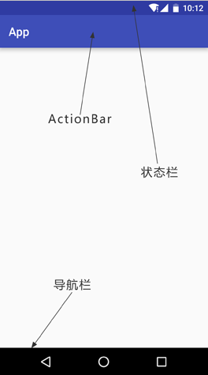
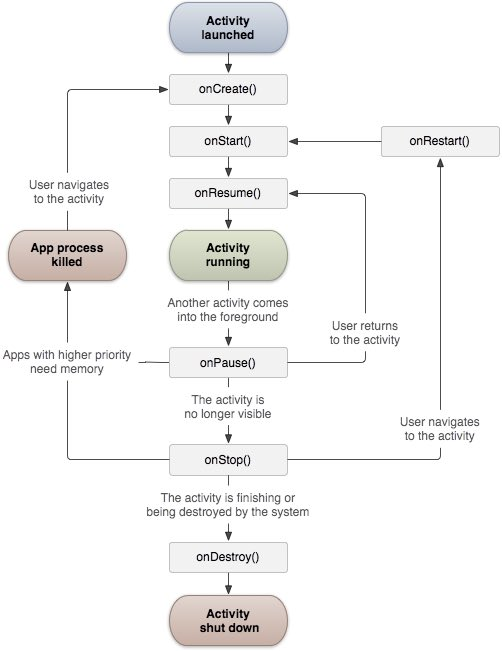
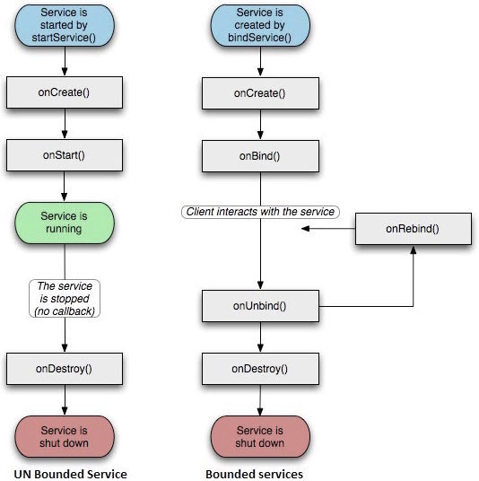
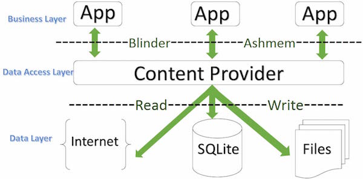

# 简介

Android是一个开源的，基于Linux的移动设备操作系统，主要使用于移动设备，如智能手机和平板电脑。Android是由谷歌及其他公司带领的开放手机联盟开发的。

## 架构


Android 操作系统是一个软件组件的栈，在架构图中它大致可以分为五个部分和四个主要层。
分别为应用层、应用框架层、系统运行层（原生库和 Android 运行时）、Linux内核层

1. 应用层：
- 核心作用：面向用户的最终产品。
- 组成：
	- 系统应用：电话、联系人、短信、设置、浏览器等。
	- 第三方应用：开发者利用框架层 API 开发的各类 App。

2. 应用框架层：为开发者直接提供服务的基础框架。
- 核心作用：提供开发 Android 应用所需的各种 API。
- 主要管理器：
	- Activity Manager：管理应用生命周期和活动栈。
	- Window Manager：管理窗口和界面布局。
	- Content Providers：实现应用间的数据共享。
	- View System：构建用户界面的控件集（如 Button、TextView）
	- Notification Manager：管理状态栏通知。
	- Package Manager：管理应用的安装、卸载和权限。

3. 系统运行层
- 原生库
	- 内容：用 C/C++ 编写，支撑 Android 系统运行的底层库。
	- 关键库：
		- WebKit/Chromium：浏览器内核。
		- OpenGL ES & Vulkan：图形渲染库。
		- SQLite：轻量级关系型数据库。
		- Media Framework：音视频播放与录制框架。

- Android 运行时
	- 核心组件：ART 虚拟机：从 Android 5.0 开始取代 Dalvik。负责将应用的 DEX 字节码转换为机器码并执行，并管理内存垃圾回收。

	- 核心 Java API 库：提供 Java 编程语言 API 的子集，供应用层调用。

4. Linux 内核层
- 核心作用：抽象硬件层，提供基础系统服务。
- 主要组件：
	- 硬件抽象层：虽然严格来说 HAL 位于内核之上，但它依赖内核驱动。
	- 驱动模型：显示驱动、蓝牙驱动、相机驱动、音频驱动、Binder（进程间通信）驱动等。
	- 核心功能：内存管理、进程管理、网络协议栈、电源管理。


## 应用程序组件

应用程序组件是一个Android应用程序的基本构建块。这些组件由应用清单文件松耦合的组织。AndroidManifest.xml 描述了应用程序的每个组件，以及他们如何交互

主要的四个组件：
- Activities：描述UI，并且处理用户与机器屏幕的交互
- Services：处理与应用程序关联的后台操作
- Broadcast Receivers：处理Android操作系统和应用程序之间的通信
- Content Providers：处理数据和数据库管理方面的问题

**Activities**(活动)

一个活动标识一个具有用户界面的单一屏幕。
举个例子，一个邮件应用程序可以包含一个活动用于显示新邮件列表，另一个活动用来编写邮件，再一个活动来阅读邮件。当应用程序拥有多于一个活动，其中的一个会被标记为当应用程序启动的时候显示。

**Services**（服务）
服务是运行在后台，执行长时间操作的组件。
举个例子，服务可以是用户在使用不同的程序时在后台播放音乐，或者在活动中通过网络获取数据但不阻塞用户交互。

**Broadcast Receivers**（广播接收器）
广播接收器简单地响应从其他应用程序或者系统发来的广播消息。
举个例子，应用程序可以发起广播来让其他应用程序知道一些数据已经被下载到设备，并且可以供他们使用。因此广播接收器会拦截这些通信并采取适当的行动。

**Content Providers**(内容提供者组件)
内容提供者组件通过请求从一个应用程序到另一个应用程序提供数据。这些请求由ContentResolver类的方法来处理。这些数据可以是存储在文件系统、数据库或者其他其他地方。

**其他组件**
- Fragments：代表活动中的一个行为或者一部分用户界面。
- Views：绘制在屏幕上的UI元素，包括按钮，列表等。
- Layouts：控制屏幕格式，展示视图外观的View的继承。
- Intents：组件间的消息连线。
- Resources：外部元素，例如字符串资源、常量资源及图片资源等。
- Manifest：应用程序的配置文件。

## UI界面



Android界面上有状态栏(status bar)、标题栏(action bar, toolbar)、导航栏 
(navigation bar) 等
- 状态栏：是指手机最顶上，显示中国移动、安全卫士、电量、网速等等，在手机的顶部。下拉就会出现通知栏。
- 标题栏：是指一个APP程序最上部的titleBar，从名字就知道它显然就是一个应用程序一个页面的标题了，例如打开QQ消息主页，最上面显示消息那一栏就是标题栏。
- 导航栏：是手机最下面的返回，HOME，菜单三个键。
- 系统栏 : 等于状态栏 + 导航栏 
- 应用栏：应用栏也称操作栏，一般是把标题栏设置为应用栏

APP实现沉浸式有三种需求：沉浸式状态栏，隐藏导航栏，APP全屏
- 沉浸式状态栏，是指状态栏与标题栏颜色相匹配，
- 隐藏导航栏，是指将导航栏隐藏，去掉下面的黑条。
- APP全屏，是指将状态栏与导航栏都隐藏，例如很多游戏界面，都是APP全屏。


# Android项目文件

- src：包含项目中所有的.java源文件，默认情况下，它包括一个 MainActivity.java源文件对应的活动类，当应用程序通过应用图标启动时，将运行它。
- gen：这包含由编译器生成的.R文件，引用了所有项目中的资源。该文件不能被修改。
- bin：这个文件夹包含Android由APT构建的.apk包文件，以及运行Android应用程序所需要的其他所有东西。
- res/drawable-hdpi：这个目录下包括所有的为高密度屏幕设计所需的drawable对象。
- res/layout：这个目录存放用于定义用户界面的文件（**view写法，现多采用jetpack compose编写**）
- res/values：这个目录存放各种各样的包含一系列资源的XML文件，比如字符串和颜色的定义。
- AndroidManifest.xml：这个是应用程序的清单文件，描述了应用程序的基础特性，声明定义它的各种组件，是Android操作系统与你的应用程序之间的接口

# Android 资源访问

程序中使用到的各种静态内容，如位图，颜色，布局定义，用户界面字符串，动画等等。这些资源一般放置在项目的 res/ 下独立子目录中

- anim/	定义动画属性的XML文件。它们被保存在res/anim/文件夹下，通过R.anim类访问
- color/	定义颜色状态列表的XML文件。它们被保存在res/color/文件夹下，通过R.color类访问
- drawable/	图片文件，如.png,.jpg,.gif或者XML文件，被编译为位图、状态列表、形状、动画图片。它们被保存在res/drawable/文件夹下，通过R.drawable类访问
- layout/	定义用户界面布局的XML文件。它们被保存在res/layout/文件夹下，通过R.layout类访问
- menu/	定义应用程序菜单的XML文件，如选项菜单，上下文菜单，子菜单等。它们被保存在res/menu/文件夹下，通过R.menu类访问
- raw/	任意的文件以它们的原始形式保存。需要根据名为R.raw.filename的资源ID，通过调用Resource.openRawResource()来打开raw文件
- values/	包含简单值(如字符串，整数，颜色等)的XML文件。这里有一些文件夹下的资源命名规范。arrays.xml代表数组资源，通过R.array类访问；integers.xml代表整数资源，通过R.integer类访问；bools.xml代表布尔值资源，通过R.bool类访问；colors.xml代表颜色资源，通过R.color类访问；dimens.xml代表维度值，通过R.dimen类访问；strings.xml代表字符串资源，通过R.string类访问；styles.xml代表样式资源，通过R.style类访问
- xml/	可以通过调用Resources.getXML()来在运行时读取任意的XML文件。可以在这里保存运行时使用的各种配置文件

# Activity（活动）

活动代表了一个具有用户界面的单一屏幕。
Android活动的声明周期如下图所示：


Activity类定义的回调如下：

| 回调        | 描述                                                         |
| :---------- | :----------------------------------------------------------- |
| onCreate()  | 这是第一个回调，在活动第一次创建时调用                       |
| onStart()   | 这个回调在活动为用户可见时被调用                             |
| onResume()  | 这个回调在应用程序与用户开始可交互的时候调用                 |
| onPause()   | 被暂停的活动无法接受用户输入，不能执行任何代码。当前活动将要被暂停，上一个活动将要被恢复时调用 |
| onStop()    | 当活动不在可见时调用                                         |
| onDestroy() | 当活动被系统销毁之前调用                                     |
| onRestart() | 当活动被停止以后重新打开时调用                               |

# Service （服务）

服务是一个后台运行的组件，执行长时间运行且不需要用户交互的任务。即使应用被销毁也依然可以工作。

服务包含两种状态：
- Started：	Android的应用程序组件，如活动，通过startService()启动了服务，则服务是Started状态。一旦启动，服务可以在后台无限期运行，即使启动它的组件已经被销毁。
- Bound：当Android的应用程序组件通过bindService()绑定了服务，则服务是Bound状态。Bound状态的服务提供了一个客户服务器接口来允许组件与服务进行交互，如发送请求，获取结果，甚至通过IPC来进行跨进程通信。

服务拥有生命周期方法，可以实现监控服务状态的变化，可以在合适的阶段执行工作。下面的左图展示了当服务通过startService()被创建时的生命周期，右图则显示了当服务通过bindService()被创建时的生命周期：


提供的回调有些：

| 回调| 描述|
|----|---|
| onStartCommand() | 其他组件(如活动)通过调用startService()来请求启动服务时，系统调用该方法。如果你实现该方法，你有责任在工作完成时通过stopSelf()或者stopService()方法来停止服务。 |
| onBind           | 当其他组件想要通过bindService()来绑定服务时，系统调用该方法。如果你实现该方法，你需要返回IBinder对象来提供一个接口，以便客户来与服务通信。你必须实现该方法，如果你不允许绑定，则直接返回null。 |
| onUnbind()       | 当客户中断所有服务发布的特殊接口时，系统调用该方法。         |
| onRebind()       | 当新的客户端与服务连接，且此前它已经通过onUnbind(Intent)通知断开连接时，系统调用该方法。 |
| onCreate()       | 当服务通过onStartCommand()和onBind()被第一次创建的时候，系统调用该方法。该调用要求执行一次性安装。 |
| onDestroy()      | 当服务不再有用或者被销毁时，系统调用该方法。你的服务需要实现该方法来清理任何资源，如线程，已注册的监听器，接收器等。 |


# Broadcast Receivers(广播接收器）

广播接收器用于响应来自其他应用程序或者系统的广播消息。这些消息有时被称为事件或者意图。例如，应用程序可以初始化广播来让其他的应用程序知道一些数据已经被下载到设备，并可以为他们所用。这样广播接收器可以定义适当的动作来拦截这些通信。

有以下两个重要的步骤来使系统的广播意图配合广播接收器工作
- 创建广播接收器
- 注册广播接收器

广播接收器接收以 Intent 对象为参数的消息
有许多系统产生的事件被定义为类Intent中的静态常量值：


| 事件常量| 描述|
|---|---|
| android.intent.action.BATTERY_CHANGED | 持久的广播，包含电池的充电状态，级别和其他信息。     |
| android.intent.action.BATTERY_LOW     | 标识设备的低电量条件。                               |
| android.intent.action.BATTERY_OKAY    | 标识电池在电量低之后，现在已经好了。                 |
| android.intent.action.BOOT_COMPLETED  | 在系统完成启动后广播一次。                           |
| android.intent.action.BUG_REPORT      | 显示报告bug的活动。|
| android.intent.action.CALL            | 执行呼叫数据指定的某人。|
| android.intent.action.CALL_BUTTON     | 用户点击"呼叫"按钮打开拨号器或者其他拨号的合适界面。 |
| android.intent.action.DATE_CHANGED    | 日期发生改变|
| android.intent.action.REBOOT          | 设备重启|


# Content Provider (内容提供者）

内容提供者组件通过请求从一个应用程序向其他的应用程序提供数据。这些请求由类 ContentResolver 的方法来处理。内容提供者可以使用不同的方式来存储数据。数据可以被存放在数据库，文件，甚至是网络。


# Fragment(碎片化)

fragment是活动的一部分，使得活动更加的模块化设计。我们可以认为fragment是一种子活动。

下面是关于fragment的认识点：

- fragment拥有自己的布局，自己的行为及自己的生命周期回调。
- 当活动在运行的时候，你可以在活动中添加或者移除fragment。
- 你可以合并多个fragment在一个单一的活动中来构建多栏的UI。
- fragment可以被用在多个活动中。
- fragment的生命周期和它的宿主活动紧密关联。这意味着活动被暂停，所有活动中的fragment被停止。
- fragment可以实现行为而没有用户界面组件。
- fragment是 Android API 版本11中被加入到 Android API。

**fragment 类型**：
基本的fragment可以分为如下所示的三种：
- 单帧fragment - 单帧fragment被如移动电话之类的手持设备使用。一个fragment如同一个视频一样显示。
- 列表fragment- 包含有特殊列表视图的fragment被叫做列表fragment。
- fragment过渡 - 与fragment事务一起使用。可以从一个fragment移动到另外一个fragment。

# Android 意图

意图是一个要执行的操作的抽象描述。它可以通过 startActivity 来启动一个活动，broadcastIntent 来发送广播到任何对它感兴趣的广播接受器组件，startService(Intent) 或者bindService(Intent， ServiceConnection, int) 来与后台服务通讯。意图本身（一个 Intent 对象）是一个被动的数据结构，保存着要执行操作的抽象描述。


Android意图是一个要执行的操作的抽象描述。它可以通过 startActivity 来启动一个活动，
broadcastIntent 来发送广播到任何对它感兴趣的广播接受器组件，
startService(Intent) 或者bindService(Intent， ServiceConnection, int) 来与后台服务通讯。

意图本身（一个 Intent 对象）是一个被动的数据结构，保存着要执行操作的抽象描述。
对于每一个组件-活动，服务，广播接收器都有独立的机制来传递意图：
- Context.startActivity():意图传递给该方法，用于启动一个新的活动或者让已存在的活动做一些新的事情。	
- Context.startService():意图传递给该方法，将初始化一个服务，或者新的信息到一个持续存在的服务。	
- Context.sendBroadcast():意图传递给该方法，信息将传递到所有对此感兴趣的广播接收器。

## 意图对象
意图对象是一包的信息，用于组件接收到的意图就像 Android 系统接受到的信息。

意图对象包括如下的组件，具体取决于要通信或者执行什么。    
1. 动作(Action)   
这是意图对象中必须的部分，被表现为一个字符串。在广播的意图中，动作一旦发生，将会被报告。动作将很大程度上决定意图的其他部分如何被组织。Intent 类定义了一系列动作常量对应不同的意图。这里是一份Android意图标准动作 列表。
意图对象中的动作可以通过 setAction() 方法来设置，通过 getAction() 方法来读取。

2. 数据(Data)      
添加数据规格到意图过滤器。这个规格可以只是一个数据类型(如元类型属性)，一条 URI ，或者同时包括数据类型和 URI 。 URI 则由不同部分的属性来指定。
这些指定 URL 格式的属性是可选的，但是也相互独立 如果意图过滤器没有指定模式，所有其他的 URI 属性将被忽略。 如果没有为过滤器指定主机，端口属性和所有路径属性将被忽略。
setData() 方法只能以 URI 来指定数据，setType() 只能以元类型指定数据，setDataAndType() 可以同时指定 URI 和元类型。URI 通过 getData() 读取，类型通过 getType() 读取。


3. 类别      
类别是意图中可选的部分，是一个字符串，包含该类型组件需要处理的意图的附加信息。
addCategory() 方法为意图对象添加类别，removeCategory() 方法删除之前添加的类别，getCategories() 获取所有被设置到意图对象中的类别。

4. 附加数据   
这是传递给需要处理意图的组件的以键值对描述的附加信息。通过 putExtras() 方法设置，getExtras() 方法读取。

5. 标记   
这些标记是意图的可选部分，说明Android系统如何来启动活动，启动后如何处理等。

6. 组件名称   
组件名称对象是一个可选的域，代表活动、服务或者广播接收器类。如果设置，则意图对象被传递到实现设计好的类的实例，否则，Android 使用其他意图中的其他信息来定位一个合适的目标。
组件名称通过 setComponent()，setClass()或者 setClassName() 来设置，通过 getComponent() 获取。

## 意图类型
Android支持两种意图类型：Explicit（显式意图）和 Implicit（隐式意图）

**显式意图**   
显式意图用于连接应用程序的内部世界，
假设你需要连接一个活动到另外一个活动，我们可以通过显示意图，下图显示通过点击按钮连接第一个活动到第二个活动。
这些意图通过名称指定目标组件，一般用于应用程序内部信息 - 比如一个活动启动一个下属活动或者启动一个兄弟活动。

举例：
````java
// 通过指定类名的显式意图
Intent i = new Intent(FirstActivity.this, SecondAcitivity.class);

// 启动目标活动
startActivity(i);
````

**隐式意图**
这些意图没有为目标命名，组件名称的域为空。隐式意图经常用于激活其他应用程序的组件。

举例：  

```java
Intent read1=new Intent();
read1.setAction(android.content.Intent.ACTION_VIEW);
read1.setData(ContactsContract.Contacts.CONTENT_URI);
startActivity(read1);
```

目标组件接收到意图，可以使用getExtras()方法来获取由源组件发送的附加数据。
举例：
```java
// 在代码中的合适位置获取包对象
Bundle extras = getIntent().getExtras();

// 通过键解压数据
String value1 = extras.getString("Key1");
String value2 = extras.getString("Key2");

```

## 意图过滤器
Android 操作系统使用过滤器来指定一系列活动、服务和广播接收器处理意图，需要借助于意图所指定的动作、类别、数据模式。
在 manifest 文件中使用 <intent-filter> 元素在活动，服务和广播接收器中列出对应的动作，类别和数据类型。

举例：   
```xml
<activity android:name=".CustomActivity"
   android:label="@string/app_name">

   <intent-filter>
      <action android:name="android.intent.action.VIEW" />
      <action android:name="com.example.MyApplication.LAUNCH" />
      <category android:name="android.intent.category.DEFAULT" />
      <data android:scheme="http" />
   </intent-filter>

</activity>
```
当活动被上面的过滤器所定义，其他活动就可以通过下面的方式来调用这个活动。
使用 android.intent.action.VIEW，使用 com.runoob.intentfilter.LAUNCH 动作，
并提供android.intent.category.DEFAULT类别。

元素指定要被调用的活动所期望的数据类型。
上面的实例中，自定义活动期望的数据由"http://"开头。 有这样的情况，通过过滤器，意图将被传递到多个的活动或者服务，用户将被询问启动哪个组件。如果没有找到目标组件，将发生一个异常。   

在调用活动之前，有一系列的 Android 检查测试：

- 过滤器 <intent-filter> 需要列出一个或者多个的动作，不能为空；过滤器至少包含一个 元素，否则将阻塞所有的意图。如果多个动作被提到，Android 在调用活动前尝试匹配其中提到的一个动作。
- 过滤器 <intent-filter> 可能列出0个，1个或者多个类别。如果没有类别被提到，Android 通过这个测试，如果有多个类别被提及，意图通过类型测试，每个意图对象的分类必须匹配过滤器中的一个分类。
- 每个 元素可以指定一个 URI 和一个数据类型(元媒体类型)。这里有独立的属性，如 URI 中的每个部分：模式，主机，端口和路径。意图包含有 URI 和类型，只有它的类型匹配了过滤器中列出的某个类型，则通过数据类型部分的测试。


# Android 意图动作等参考手册

## 动作列表

1. **基础核心动作**

| 动作常量        | 常量值                         | 说明  |
|------------ | ----------------------------- | ---- |
| ACTION_MAIN | `android.intent.action.MAIN`  | 应用程序入口，不接收数据，启动应用的主 Activity |
| ACTION_VIEW | `android.intent.action.VIEW`  | 以最合适的方式显示数据（如 http 开链接，tel 拨号） |
| ACTION_EDIT | `android.intent.action.EDIT`  | 编辑指定 URI 处的数据 |
| ACTION_DELETE | `android.intent.action.DELETE` | 删除 URI 指定的数据项 |
| ACTION_DEFAULT | `android.intent.action.VIEW`  | ACTION_VIEW 的同义词 |

2. **拨号与通讯动作**

| 动作常量       | 常量值             | 说明              | 所需权限 |
| ------------ | ------------ | -------------- | ---- |
| ACTION_DIAL  | `android.intent.action.DIAL`       | 打开拨号盘，预填号码（不呼出） | 无 |
| ACTION_CALL  | `android.intent.action.CALL`       | 直接拨打指定号码   | `CALL_PHONE`|
| ACTION_ANSWER | `android.intent.action.ANSWER`     | 接听来电                      | 无|
| ACTION_CALL_BUTTON | `android.intent.action.CALL_BUTTON` | 用户按下通话按钮 | - |

3. **数据选取与插入动作**

|动作常量|	常量值|	说明|
|---|---|---|
|ACTION_PICK	|android.intent.action.PICK	|从列表中选取一项，返回 URI|
|ACTION_GET_CONTENT	|android.intent.action.GET_CONTENT	|选择特定类型的数据（如图片、文件）|
|ACTION_INSERT	|android.intent.action.INSERT	|在容器中插入空项|
|ACTION_INSERT_OR_EDIT	|android.intent.action.INSERT_OR_EDIT	|插入新项或编辑现有项|
|ACTION_PASTE	|android.intent.action.PASTE	|从剪贴板粘贴数据|

4. **分享与发送动作**

|动作|常量|	常量值|	说明|
|---|---|---|---|
|ACTION_SEND	|android.intent.action.SEND	|发送单条数据（文本、图片等）|
|ACTION_SEND_MULTIPLE	|android.intent.action.SEND_MULTIPLE	|批量发送多条数据|
|ACTION_SENDTO	|android.intent.action.SENDTO	|向 URI 指定联系人发送消息|

5. **搜索动作**

|动作常量|	常量值|	说明|
|---|---|---|
|ACTION_SEARCH	|android.intent.action.SEARCH	|执行搜索|
|ACTION_WEB_SEARCH	|android.intent.action.WEB_SEARCH	|执行网络搜索|
|ACTION_VOICE_COMMAND	|android.intent.action.VOICE_COMMAND	|启动语音命令|

6. **系统广播动作（系统发送，应用接收）**

|动作常量|	常量值|	说明|
|---|---|---|
|ACTION_BOOT_COMPLETED	|android.intent.action.BOOT_COMPLETED	|系统启动完成|
|ACTION_BATTERY_CHANGED	|android.intent.action.BATTERY_CHANGED	|电池状态变化（粘性广播）|
|ACTION_BATTERY_LOW	|android.intent.action.BATTERY_LOW	|电量过低|
|ACTION_BATTERY_OKAY	|android.intent.action.BATTERY_OKAY	|电量恢复正常|
|ACTION_POWER_CONNECTED	|android.intent.action.ACTION_POWER_CONNECTED	|连接外部电源|
|ACTION_SCREEN_ON	|android.intent.action.SCREEN_ON	|屏幕亮起|
|ACTION_SCREEN_OFF	|android.intent.action.SCREEN_OFF	|屏幕熄灭|
|ACTION_TIME_CHANGED	|android.intent.action.TIME_CHANGED	|系统时间改变|
|ACTION_TIMEZONE_CHANGED	|android.intent.action.TIMEZONE_CHANGED	|时区改变|
|ACTION_DATE_CHANGED	|android.intent.action.DATE_CHANGED	|日期改变|
|ACTION_CONFIGURATION_CHANGED	|android.intent.action.CONFIGURATION_CHANGED	|设备配置变化（如屏幕方向）|
|ACTION_LOCALE_CHANGED	|android.intent.action.LOCALE_CHANGED	|语言区域改变|
|ACTION_DEVICE_STORAGE_LOW	|android.intent.action.DEVICE_STORAGE_LOW	|存储空间不足|
|ACTION_DEVICE_STORAGE_OK	|android.intent.action.DEVICE_STORAGE_OK	|存储恢复正常|

7. **应用管理广播动作**

|动作常量|	常量值| 	说明    |
|---|---|--------|
|ACTION_PACKAGE_ADDED|	android.intent.action.PACKAGE_ADDED| 	安装新应用 |
|ACTION_PACKAGE_REMOVED|	android.intent.action.PACKAGE_REMOVED|	卸载应用|
|ACTION_PACKAGE_CHANGED|	android.intent.action.PACKAGE_CHANGED|	应用改变（如更新）|
|ACTION_INSTALL_PACKAGE|	android.intent.action.INSTALL_PACKAGE|	启动应用安装程序|

8. **媒体与硬件动作**

|动作常量|	常量值|	说明|
|---|---|---|
|ACTION_MEDIA_BUTTON	|android.intent.action.MEDIA_BUTTON	|按下媒体按钮|
|ACTION_CAMERA_BUTTON	|android.intent.action.CAMERA_BUTTON	|按下相机按钮|
|ACTION_HEADSET_PLUG	|android.intent.action.HEADSET_PLUG	|耳机插入/拔出|
|ACTION_MEDIA_EJECT	|android.intent.action.MEDIA_EJECT	|用户请求弹出外部存储|
|ACTION_MEDIA_REMOVED	|android.intent.action.MEDIA_REMOVED	|外部存储被移除|
|ACTION_SET_WALLPAPER	|android.intent.action.SET_WALLPAPER	|选择壁纸|
|ACTION_WALLPAPER_CHANGED	|android.intent.action.WALLPAPER_CHANGED	|壁纸已更改|

9. **其他动作**

|动作常量|	常量值|	说明|
|---|---|---|
|ACTION_ALL_APPS	|android.intent.action.ALL_APPS	|列出所有可用应用|
|ACTION_SYNC	|android.intent.action.SYNC	|执行数据同步|
|ACTION_REBOOT	|android.intent.action.REBOOT	|重启设备（仅系统使用）|
|ACTION_SHUTDOWN	|android.intent.action.ACTION_SHUTDOWN	|设备关机|
|ACTION_BUG_REPORT	|android.intent.action.BUG_REPORT	|显示错误报告界面|
|ACTION_FACTORY_TEST	|android.intent.action.FACTORY_TEST	|工厂测试入口|
|ACTION_DREAMING_STARTED	|android.intent.action.DREAMING_STARTED	|屏保开始|
|ACTION_DREAMING_STOPPED	|android.intent.action.DREAMING_STOPPED	|屏保结束|
|ACTION_DOCK_EVENT	|android.intent.action.DOCK_EVENT	|设备底座状态变化|
